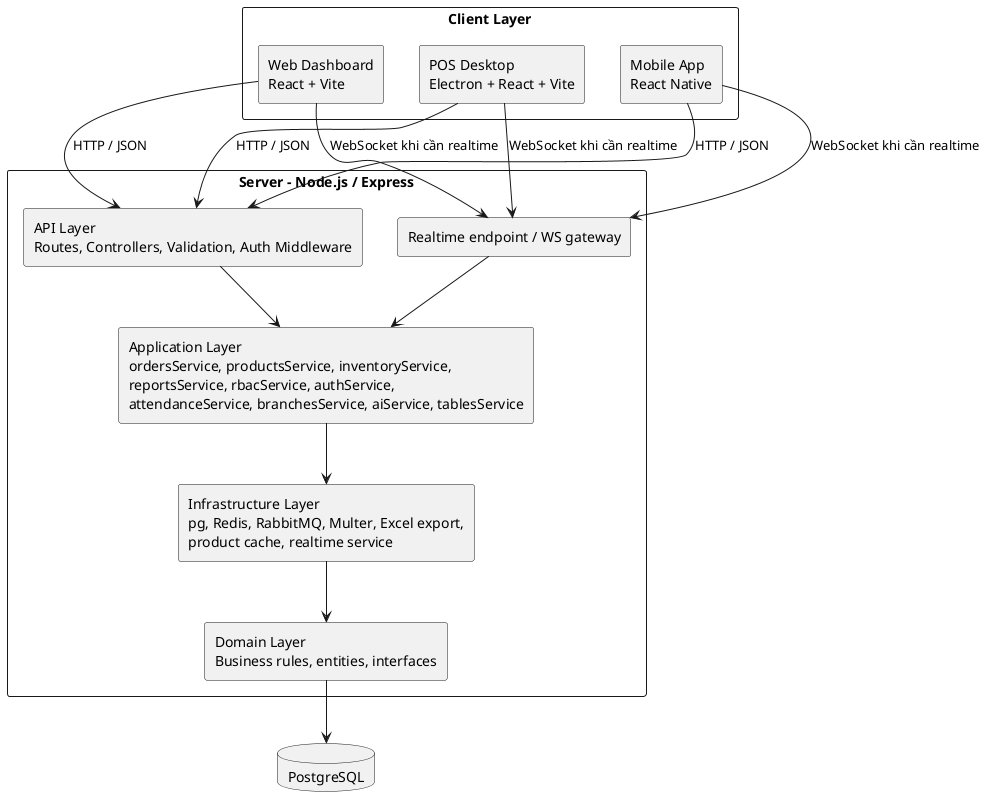

# Kiến trúc hệ thống — AutoManager

Tài liệu này mô tả kiến trúc hệ thống của AutoManager theo phong cách phân lớp giống mẫu tham chiếu: `Client -> API Layer -> Application Layer -> Infrastructure Layer -> Domain Layer -> Database`.
Khác với mẫu ASP.NET, dự án này dùng `React / React Native / Electron` ở phía client, `Node.js + Express` ở phía server, và `PostgreSQL` làm cơ sở dữ liệu giao dịch trung tâm.

## 1. Tổng quan kiến trúc

Hệ thống được tổ chức theo mô hình client-server nhiều lớp:

- Lớp Client gồm 3 ứng dụng giao diện:
  - `web-dashboard`: dashboard quản trị chạy trên trình duyệt.
  - `pos-desktop`: ứng dụng POS desktop chạy bằng Electron.
  - `mobile-app`: ứng dụng di động React Native cho tác vụ vận hành.
- Lớp Server là backend Express, nhận request qua HTTP/JSON và WebSocket khi cần realtime.
- Lớp Application chứa các service nghiệp vụ như đơn hàng, kho, phân quyền, báo cáo, ca làm, chi nhánh, AI.
- Lớp Infrastructure xử lý tích hợp kỹ thuật như PostgreSQL, Redis, RabbitMQ, file upload, export, realtime.
- Lớp Domain là lõi quy tắc nghiệp vụ và mô hình dữ liệu của hệ thống.
- Database trung tâm là `PostgreSQL`, được quản lý bằng migration trong `db/migrations/`.

### 1.1. Sơ đồ kiến trúc tổng quan

## 2. Mô tả từng lớp

### 2.1. Client Layer

Đây là lớp giao diện người dùng, tách theo từng kịch bản sử dụng:

- `web-dashboard` dùng React + Vite để quản trị sản phẩm, nhân viên, báo cáo và phân quyền.
- `pos-desktop` dùng Electron để phục vụ bán hàng tại quầy, cho phép thao tác nhanh và có thể mở rộng realtime.
- `mobile-app` dùng React Native để hỗ trợ tác vụ di động như theo dõi ca làm, check-in/check-out và nghiệp vụ vận hành.

Tất cả client giao tiếp với backend qua HTTP API, sử dụng các service riêng trong từng ứng dụng để gọi endpoint và quản lý trạng thái.

### 2.2. API Layer

Lớp API là điểm vào của hệ thống, nằm trong `services/backend/src/routes/`, `controllers/`, `validation/` và `middleware/`.

Chức năng chính:

- Định tuyến request theo từng nhóm nghiệp vụ: auth, orders, products, inventory, reports, attendance, branches, RBAC, audit logs, tables, AI.
- Kiểm tra dữ liệu đầu vào bằng schema validation.
- Xác thực và phân quyền bằng middleware.
- Chuyển request hợp lệ sang application service phù hợp.

### 2.3. Application Layer

Lớp này chứa logic nghiệp vụ chính trong `services/backend/src/services/`.

Các service nổi bật:

- `authService` xử lý đăng nhập, JWT và định danh người dùng.
- `rbacService` xử lý vai trò, quyền và phạm vi chi nhánh.
- `ordersService` quản lý tạo đơn, thêm món, thanh toán và trạng thái đơn.
- `productsService` quản lý danh mục, sản phẩm và giá theo chi nhánh.
- `inventoryService` xử lý nhập/xuất kho, nguyên liệu và kiểm kê.
- `attendanceService` xử lý ca làm, check-in và check-out.
- `reportsService` tổng hợp báo cáo doanh thu, kho và chấm công.
- `branchesService` xử lý CRUD chi nhánh và thông tin vị trí.
- `tablesService` xử lý bàn phục vụ cho nghiệp vụ POS.
- `aiService` cung cấp gợi ý dự báo và đề xuất đặt hàng lại.
- `auditLogsService` và `auditService` phục vụ ghi nhận, truy vết và tra cứu lịch sử thao tác.

Đây là nơi kết hợp dữ liệu từ nhiều nguồn trước khi ghi xuống database hoặc trả về client.

### 2.4. Infrastructure Layer

Lớp hạ tầng nằm ở `services/backend/src/services/infra/` và các module tích hợp liên quan.

Các thành phần chính:

- PostgreSQL driver qua `pg` để truy cập dữ liệu giao dịch.
- Redis để cache và hỗ trợ các luồng truy cập lặp lại.
- RabbitMQ để xử lý tác vụ nền và tách bớt nghiệp vụ nặng.
- WebSocket để hỗ trợ realtime, đặc biệt hữu ích cho POS desktop.
- Multer để upload file, ví dụ ảnh sản phẩm.
- Excel export để xuất báo cáo.
- Product cache service để tăng tốc truy vấn danh mục và giá.

Lớp này không chứa luật nghiệp vụ, mà tập trung vào cách hệ thống giao tiếp với tài nguyên bên ngoài.

### 2.5. Domain Layer

Lớp Domain là phần lõi của hệ thống, nơi đặt các quy tắc nghiệp vụ ổn định nhất.

Trong AutoManager, domain được thể hiện thông qua:

- Mô hình dữ liệu trong PostgreSQL.
- Các quy tắc hợp lệ của đơn hàng, thanh toán, kiểm kê, chấm công, phân quyền và chi nhánh.
- DTO, interface và các quy ước dữ liệu dùng chung giữa API, service và database.

Các quy tắc này giúp hệ thống giữ được tính nhất quán dù thay đổi giao diện hay hạ tầng phía ngoài.

## 3. Cơ sở dữ liệu

Database trung tâm là `PostgreSQL`.

- Schema được quản lý bằng các file migration trong `db/migrations/`.
- Mọi dữ liệu nghiệp vụ quan trọng như người dùng, đơn hàng, thanh toán, kho, ca làm, audit log và e-invoice đều được lưu tại đây.
- Các bảng chính được thiết kế theo mô hình đa chi nhánh với `branch_id` để cô lập dữ liệu theo đơn vị vận hành.

Các nhóm bảng tiêu biểu:

- Nhóm định danh và phân quyền: `users`, `roles`, `permissions`, `user_roles`, `role_permissions`, `user_branch_access`.
- Nhóm bán hàng: `tables`, `orders`, `order_items`, `payments`.
- Nhóm danh mục và giá: `products`, `product_categories`, `product_branch_prices`.
- Nhóm kho: `ingredients`, `inventory_transactions`, `inventory_categories`, `stocktakes`, `stocktake_items`.
- Nhóm nhân sự: `employees`, `shifts`, `attendance`.
- Nhóm hệ thống: `branches`, `audit_logs`, `e_invoice_settings`, `e_invoices`, `idempotency_keys`.

## 4. Luồng dữ liệu chính

### 4.1. Đăng nhập

1. Client gửi thông tin đăng nhập đến API.
2. API xác thực dữ liệu, gọi `authService`.
3. Service kiểm tra mật khẩu, vai trò và quyền truy cập chi nhánh.
4. Hệ thống trả JWT hoặc session token về client.

### 4.2. Tạo đơn hàng

1. POS hoặc web dashboard gửi request tạo đơn đến `ordersController`.
2. `ordersService` xử lý logic đơn, kiểm tra idempotency, tính tổng tiền và trạng thái.
3. Dữ liệu được ghi xuống PostgreSQL trong một transaction.
4. Hệ thống ghi audit log và có thể đẩy tác vụ liên quan sang Redis/RabbitMQ.

### 4.3. Báo cáo

1. Client gọi API báo cáo.
2. `reportsService` tổng hợp dữ liệu từ các bảng nghiệp vụ.
3. Nếu truy vấn nặng, service có thể tận dụng cache, pre-aggregation hoặc export sang Excel.

## 5. Đặc điểm kiến trúc

- Tách lớp rõ ràng để dễ bảo trì và mở rộng.
- Client đa nền tảng nhưng dùng chung backend API.
- Hỗ trợ multi-branch bằng `branch_id` và bảng cấp quyền theo chi nhánh.
- Có sẵn nền tảng cho realtime, cache và xử lý nền.
- Phù hợp cho mô hình triển khai nội bộ cửa hàng hoặc triển khai tập trung.

## 6. Kết luận

Kiến trúc AutoManager là kiến trúc client-server nhiều lớp, trong đó giao diện được tách thành web, desktop và mobile; backend Express đảm nhiệm toàn bộ nghiệp vụ; PostgreSQL là nguồn dữ liệu trung tâm; còn Redis và RabbitMQ hỗ trợ hiệu năng và các tác vụ nền.

---
Generated: Architecture - AutoManager
