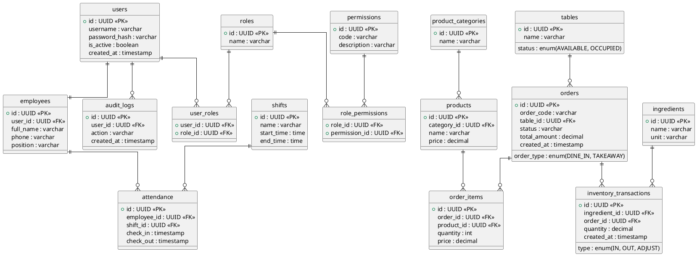

# ERD & Final Schema — AutoManager POS

Tài liệu này hợp nhất sơ đồ PlantUML do bạn cung cấp với DDL mẫu trước đó, cho ra ERD hoàn chỉnh và DDL tham khảo cho các bảng lõi.

## Embedded PlantUML (reference)

## Consolidated ERD notes
- Merged concepts: split `users` and `employees` (employee profile linked to user account). RBAC uses `user_roles`, `roles`, `permissions`, `role_permissions`.
- Orders support `order_type` (DINE_IN/TAKEAWAY), `table_id` optional for TAKEAWAY. Include `client_id` and `idempotency_key` for offline sync and idempotency.
- Products use categories.
- Inventory modeled by `ingredients` + `inventory_transactions` with optional link to `order_id` for processing traces (but system won't auto-decrement inventory on sale by policy).
- Audit logs kept for 1 year by retention policy.

## Final PostgreSQL DDL (refined)
-- Use `pgcrypto` or `pguuid` for gen_random_uuid()

-- Branches
CREATE TABLE branches (
  id UUID PRIMARY KEY DEFAULT gen_random_uuid(),
  name TEXT NOT NULL,
  address TEXT,
  created_at TIMESTAMP WITH TIME ZONE DEFAULT now()
);

-- Users & Employees
CREATE TABLE users (
  id UUID PRIMARY KEY DEFAULT gen_random_uuid(),
  username TEXT UNIQUE NOT NULL,
  password_hash TEXT,
  is_active BOOLEAN DEFAULT TRUE,
  created_at TIMESTAMP WITH TIME ZONE DEFAULT now()
);

CREATE TABLE employees (
  id UUID PRIMARY KEY DEFAULT gen_random_uuid(),
  user_id UUID REFERENCES users(id) ON DELETE CASCADE,
  branch_id UUID REFERENCES branches(id),
  full_name TEXT,
  phone TEXT,
  position TEXT,
  created_at TIMESTAMP WITH TIME ZONE DEFAULT now()
);

-- RBAC
CREATE TABLE roles (id UUID PRIMARY KEY DEFAULT gen_random_uuid(), name TEXT NOT NULL);
CREATE TABLE permissions (id UUID PRIMARY KEY DEFAULT gen_random_uuid(), code TEXT UNIQUE NOT NULL, description TEXT);
CREATE TABLE role_permissions (role_id UUID REFERENCES roles(id) ON DELETE CASCADE, permission_id UUID REFERENCES permissions(id) ON DELETE CASCADE, PRIMARY KEY(role_id, permission_id));
CREATE TABLE user_roles (user_id UUID REFERENCES users(id) ON DELETE CASCADE, role_id UUID REFERENCES roles(id) ON DELETE CASCADE, PRIMARY KEY(user_id, role_id));

-- Audit logs
CREATE TABLE audit_logs (id UUID PRIMARY KEY DEFAULT gen_random_uuid(), user_id UUID REFERENCES users(id), action TEXT NOT NULL, object_type TEXT, object_id UUID, payload JSONB, created_at TIMESTAMP WITH TIME ZONE DEFAULT now());

-- Shifts & Attendance
CREATE TABLE shifts (id UUID PRIMARY KEY DEFAULT gen_random_uuid(), name TEXT, start_time TIME, end_time TIME);
CREATE TABLE attendance (id UUID PRIMARY KEY DEFAULT gen_random_uuid(), employee_id UUID REFERENCES employees(id), shift_id UUID REFERENCES shifts(id), check_in TIMESTAMP WITH TIME ZONE, check_out TIMESTAMP WITH TIME ZONE);

-- Tables (restaurant)
CREATE TABLE tables (id UUID PRIMARY KEY DEFAULT gen_random_uuid(), branch_id UUID REFERENCES branches(id), name TEXT, status TEXT DEFAULT 'AVAILABLE');

-- Products
CREATE TABLE product_categories (id UUID PRIMARY KEY DEFAULT gen_random_uuid(), name TEXT NOT NULL);
CREATE TABLE products (id UUID PRIMARY KEY DEFAULT gen_random_uuid(), branch_id UUID REFERENCES branches(id), category_id UUID REFERENCES product_categories(id), sku TEXT, name TEXT NOT NULL, price NUMERIC(12,2) NOT NULL, metadata JSONB, created_at TIMESTAMP WITH TIME ZONE DEFAULT now());
CREATE INDEX idx_products_branch ON products(branch_id, id);

-- Orders & items
CREATE TABLE orders (
  id UUID PRIMARY KEY DEFAULT gen_random_uuid(),
  branch_id UUID REFERENCES branches(id) NOT NULL,
  client_id TEXT, -- local temp id for offline
  idempotency_key TEXT, -- optional server-side store for idempotency
  created_by UUID REFERENCES users(id),
  order_code TEXT,
  order_type TEXT NOT NULL,
  table_id UUID REFERENCES tables(id),
  order_status TEXT NOT NULL DEFAULT 'OPEN',
  payment_status TEXT NOT NULL DEFAULT 'UNPAID',
  total_amount NUMERIC(12,2) NOT NULL DEFAULT 0,
  metadata JSONB,
  created_at TIMESTAMP WITH TIME ZONE DEFAULT now(),
  updated_at TIMESTAMP WITH TIME ZONE DEFAULT now()
);
CREATE INDEX idx_orders_branch_created ON orders(branch_id, created_at);

CREATE TABLE order_items (
  id UUID PRIMARY KEY DEFAULT gen_random_uuid(),
  order_id UUID REFERENCES orders(id) ON DELETE CASCADE,
  product_id UUID REFERENCES products(id),
  name TEXT NOT NULL,
  quantity INTEGER NOT NULL DEFAULT 1,
  unit_price NUMERIC(12,2) NOT NULL,
  subtotal NUMERIC(12,2) NOT NULL,
  created_at TIMESTAMP WITH TIME ZONE DEFAULT now()
);
CREATE INDEX idx_order_items_order ON order_items(order_id);

-- Payments
CREATE TABLE payments (
  id UUID PRIMARY KEY DEFAULT gen_random_uuid(),
  order_id UUID REFERENCES orders(id) ON DELETE CASCADE,
  amount NUMERIC(12,2) NOT NULL,
  payment_method TEXT NOT NULL,
  provider_metadata JSONB,
  created_at TIMESTAMP WITH TIME ZONE DEFAULT now()
);

-- Ingredients & Inventory
CREATE TABLE ingredients (id UUID PRIMARY KEY DEFAULT gen_random_uuid(), name TEXT NOT NULL, unit TEXT);

CREATE TABLE inventory_transactions (
  id UUID PRIMARY KEY DEFAULT gen_random_uuid(),
  branch_id UUID REFERENCES branches(id) NOT NULL,
  ingredient_id UUID REFERENCES ingredients(id),
  order_id UUID REFERENCES orders(id),
  quantity NUMERIC(12,3) NOT NULL,
  transaction_type TEXT NOT NULL,
  reason TEXT,
  created_by UUID REFERENCES users(id),
  created_at TIMESTAMP WITH TIME ZONE DEFAULT now()
);
CREATE INDEX idx_invtx_branch ON inventory_transactions(branch_id, created_at);

## Implementation notes
- Idempotency: persist `idempotency_key` (with expiry) to guard against duplicate remote submissions from offline client.
- Offline: client must set `client_id` and `idempotency_key`; server grants canonical `id` and returns mapping.
- Inventory: since policy says "no auto-decrement on sale", inventory_transactions for OUT should be produced by kitchen/process workflows or manual adjustments.
- Partitioning: consider partitioning `orders` by `branch_id` or date for scale.

---
Finalized ERD & DDL sample. See `docs/Architecture - AutoManager.md` for higher-level architecture.
