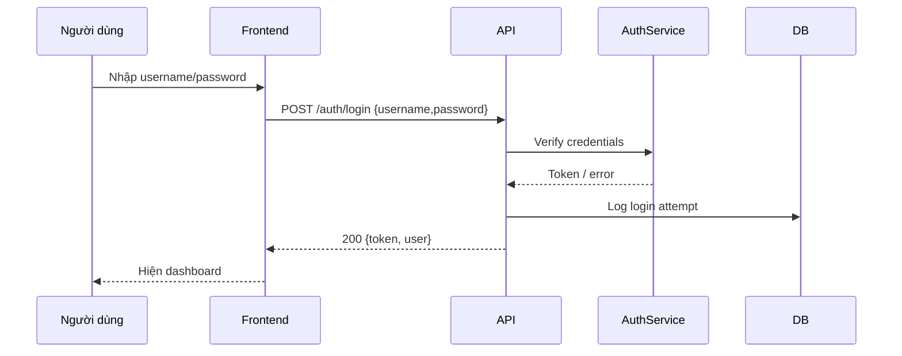
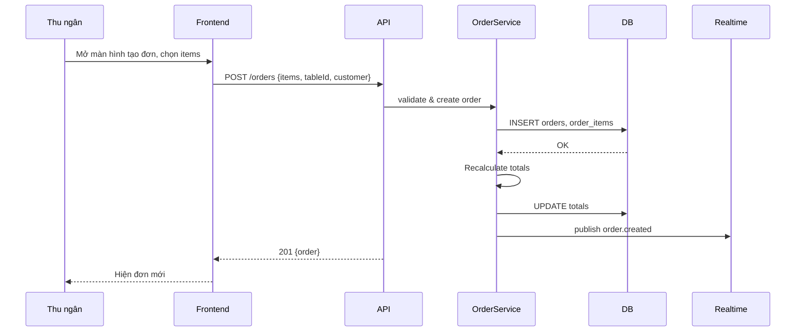
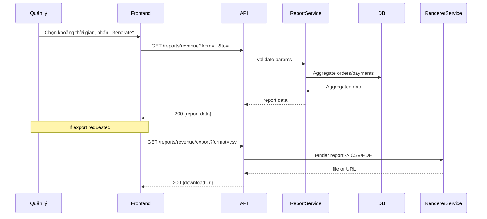
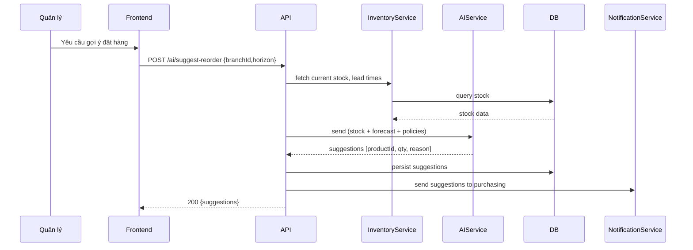
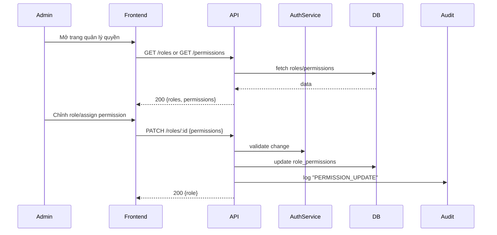

# Rà Soát Yêu Cầu vs Hiện Trạng Code

**Ngày rà soát**: 03/05/2026  
**Tài liệu tham khảo**: [3.1-Yeu-cau-he-thong.md](3.1-Yeu-cau-he-thong.md)

---

## **Sequence Diagrams (Biểu đồ tuần tự)**

Below are Mermaid sequence diagrams for commonly requested use cases. Replace or export these to PlantUML if you prefer.

### UC: Đăng nhập (Login)



---

### UC: Tạo đơn (Create Order)



---

### UC: Revenue Report (Generate & Export flow)



---

### UC: AI Suggest Reorder



---

### UC: Manage Permissions (Quản lý quyền)



---

### **UC-67: AI Forecast Demand (Dự báo nhu cầu bằng AI)**

| Thuộc tính | Chi tiết |
|-----------|---------|
| **ID** | UC-67 |
| **Tên** | AI Forecast Demand / Dự báo nhu cầu bằng AI |
| **Diễn viên chính** | Quản lý, Kho (`AI_USE` permission) |
| **Mô tả** | Gọi mô-đun AI để dự báo nhu cầu bán hàng theo sản phẩm/chi nhánh/khoảng thời gian |
| **Endpoint** | `POST /ai/forecast` |

**Điều kiện tiên quyết:**
- User có quyền `AI_USE`
- Dữ liệu lịch sử bán hàng có sẵn để mô hình sử dụng

**Luộng sự kiện chính:**
1. Người dùng mở giao diện dự báo hoặc trigger từ báo cáo
2. Frontend gửi `POST /ai/forecast` với params (products, from, to, horizon, granularity)
3. Server:
   - Kiểm tra quyền
   - Validate params
   - Chuẩn bị dữ liệu đầu vào (aggregate lịch sử, promotions, seasonality)
   - Gọi service AI/ML (internal hoặc external) với payload
   - Nhận kết quả dự báo (demand per period, confidence)
   - Ghi audit log: "AI_FORECAST: {userId}, {products}, {params}"
   - Trả về dự báo kèm metadata (model version, confidence)

**Luộng sự kiện thay thế:**
- **Alt 1**: Nếu mô hình trả về lỗi, fallback dùng heuristic đơn giản

**Ngoại lệ:**
- **Err 1**: User không có quyền → 403 "Forbidden"
- **Err 2**: Input không hợp lệ → 400 "Invalid forecast params"
- **Err 3**: AI service thất bại → 502 "Forecast service unavailable"
- **Err 4**: Lỗi nội bộ → 500 "Failed to generate forecast"

**Điều kiện sau:**
- Trả về dự báo nhu cầu có thể dùng để lập kế hoạch mua hàng và phân bổ tồn kho

---

### **UC-68: AI Suggest Reorder (Gợi ý đặt hàng lại bằng AI)**

| Thuộc tính | Chi tiết |
|-----------|---------|
| **ID** | UC-68 |
| **Tên** | AI Suggest Reorder / Gợi ý đặt hàng lại bằng AI |
| **Diễn viên chính** | Quản lý, Kho (`AI_USE` or `REORDER_SUGGEST` permission) |
| **Mô tả** | Dựa trên dự báo và tồn kho hiện tại, AI gợi ý các sản phẩm cần đặt hàng và số lượng |
| **Endpoint** | `POST /ai/suggest-reorder` |

**Điều kiện tiên quyết:**
- User có quyền `AI_USE` hoặc `REORDER_SUGGEST`
- Dữ liệu tồn kho và dự báo khả dụng

**Luộng sự kiện chính:**
1. Người dùng mở màn hình gợi ý đặt hàng hoặc chạy batch
2. Frontend gửi `POST /ai/suggest-reorder` (params: branchId, horizon, safetyStockPolicy)
3. Server:
   - Kiểm tra quyền
   - Chuẩn bị dữ liệu (current stock, reserved, lead times, forecast)
   - Gọi AI service để tính reorder suggestions
   - Nhận kết quả: list(productId, suggestedQty, reason, priority)
   - Ghi audit log: "AI_REORDER_SUGGEST: {userId}, {branchId}, {params}"
   - Trả về gợi ý kèm confidence và metadata

**Luộng sự kiện thay thế:**
- **Alt 1**: Nếu AI không khả dụng, trả về reorder theo rule-based reorder points

**Ngoại lệ:**
- **Err 1**: User không có quyền → 403 "Forbidden"
- **Err 2**: Dữ liệu thiếu → 400 "Insufficient data for suggestions"
- **Err 3**: AI service lỗi → 502 "Reorder suggestion service unavailable"
- **Err 4**: Lỗi DB → 500 "Failed to generate reorder suggestions"

**Điều kiện sau:**
- Trả về danh sách gợi ý đặt hàng, có thể chuyển sang PO hoặc export

---

### **UC-69: View Audit Logs (Xem nhật ký audit)**

| Thuộc tính | Chi tiết |
|-----------|---------|
| **ID** | UC-69 |
| **Tên** | View Audit Logs / Xem nhật ký audit |
| **Diễn viên chính** | Quản lý, Bảo mật (`AUDIT_VIEW` permission) |
| **Mô tả** | Lấy các bản ghi audit (user actions, system events) theo bộ lọc |
| **Endpoint** | `GET /audit-logs` |

**Điều kiện tiên quyết:**
- User có quyền `AUDIT_VIEW`

**Luộng sự kiện chính:**
1. Người dùng mở màn hình audit/forensics
2. Frontend gửi `GET /audit-logs` (params: from, to, userId, actionType, resource)
3. Server:
   - Kiểm tra quyền
   - Query audit store / ELK theo filter
   - Trả về logs kèm metadata và pagination

**Luộng sự kiện thay thế:**
- **Alt 1**: Forward logs đến SIEM hoặc export để điều tra

**Ngoại lệ:**
- **Err 1**: User không có quyền → 403 "Forbidden"
- **Err 2**: Lỗi hệ thống logs → 500 "Failed to retrieve audit logs"

**Điều kiện sau:**
- Trả về các bản ghi audit cho mục đích điều tra và tuân thủ

---

### **UC-70: List Branches (Liệt kê chi nhánh)**

| Thuộc tính | Chi tiết |
|-----------|---------|
| **ID** | UC-70 |
| **Tên** | List Branches / Liệt kê chi nhánh |
| **Diễn viên chính** | Quản lý, Admin (`BRANCH_VIEW` permission) |
| **Mô tả** | Lấy danh sách các chi nhánh/hệ thống cửa hàng |
| **Endpoint** | `GET /branches` |

**Điều kiện tiên quyết:**
- User có quyền `BRANCH_VIEW`

**Luộng sự kiện chính:**
1. Người dùng mở trang quản lý chi nhánh
2. Frontend gửi `GET /branches` (params: region, status, pagination)
3. Server:
   - Kiểm tra quyền
   - Lấy danh sách branches theo filter
   - Trả về danh sách và metadata

**Luộng sự kiện thay thế:**
- **Alt 1**: Nếu user có role restricted, lọc chỉ chi nhánh được phép xem

**Ngoại lệ:**
- **Err 1**: User không có quyền → 403 "Forbidden"
- **Err 2**: Lỗi DB → 500 "Failed to list branches"

**Điều kiện sau:**
- Trả về danh sách chi nhánh phù hợp

---

### **UC-71: Get Branch Details (Chi tiết chi nhánh)**

| Thuộc tính | Chi tiết |
|-----------|---------|
| **ID** | UC-71 |
| **Tên** | Get Branch Details / Chi tiết chi nhánh |
| **Diễn viên chính** | Quản lý, Admin (`BRANCH_VIEW` permission) |
| **Mô tả** | Lấy thông tin chi nhánh cụ thể (địa chỉ, giờ mở, contact, config) |
| **Endpoint** | `GET /branches/:id` |

**Điều kiện tiên quyết:**
- User có quyền `BRANCH_VIEW`

**Luộng sự kiện chính:**
1. Người dùng chọn một chi nhánh
2. Frontend gửi `GET /branches/:id`
3. Server:
   - Kiểm tra quyền
   - Lấy chi nhánh theo id
   - Trả về chi tiết branch

**Luộng sự kiện thay thế:**
- **Alt 1**: Nếu branch không thuộc quyền user, trả 403

**Ngoại lệ:**
- **Err 1**: Branch không tồn tại → 404 "Branch not found"
- **Err 2**: User không có quyền → 403 "Forbidden"
- **Err 3**: Lỗi DB → 500 "Failed to get branch details"

**Điều kiện sau:**
- Trả về thông tin chi nhánh chi tiết

---

### **UC-72: Create Branch (Tạo chi nhánh)**

| Thuộc tính | Chi tiết |
|-----------|---------|
| **ID** | UC-72 |
| **Tên** | Create Branch / Tạo chi nhánh |
| **Diễn viên chính** | Admin (`BRANCH_MANAGE` permission) |
| **Mô tả** | Tạo một chi nhánh mới trong hệ thống |
| **Endpoint** | `POST /branches` |

**Điều kiện tiên quyết:**
- User có quyền `BRANCH_MANAGE`
 - Payload chứa tên, địa chỉ, timezone, contact

**Luộng sự kiện chính:**
1. Admin mở form tạo chi nhánh
2. Frontend gửi `POST /branches` với payload
3. Server:
   - Kiểm tra quyền
   - Validate dữ liệu
   - Tạo record branch
   - Ghi audit log: "BRANCH_CREATE: {branchId}, {userId}"
   - Trả về branch vừa tạo

**Luộng sự kiện thay thế:**
- **Alt 1**: Tạo branch kèm cấu hình ban đầu (POS config, printers)

**Ngoại lệ:**
- **Err 1**: User không có quyền → 403 "Forbidden"
- **Err 2**: Dữ liệu không hợp lệ → 400 "Invalid branch data"
- **Err 3**: Lỗi DB → 500 "Failed to create branch"

**Điều kiện sau:**
- Chi nhánh được tạo và sẵn sàng sử dụng

---

### **UC-73: Update Branch (Cập nhật chi nhánh)**

| Thuộc tính | Chi tiết |
|-----------|---------|
| **ID** | UC-73 |
| **Tên** | Update Branch / Cập nhật chi nhánh |
| **Diễn viên chính** | Admin (`BRANCH_MANAGE` permission) |
| **Mô tả** | Cập nhật thông tin chi nhánh (tên, contact, giờ mở) |
| **Endpoint** | `PATCH /branches/:id` |

**Điều kiện tiên quyết:**
- User có quyền `BRANCH_MANAGE`

**Luộng sự kiện chính:**
1. Admin chỉnh thông tin chi nhánh
2. Frontend gửi `PATCH /branches/:id` với các trường cần cập nhật
3. Server:
   - Kiểm tra quyền
   - Validate và áp dụng cập nhật
   - Ghi audit log: "BRANCH_UPDATE: {branchId}, {userId}"
   - Trả về chi nhánh đã cập nhật

**Luộng sự kiện thay thế:**
- **Alt 1**: Rollback nếu cập nhật thất bại giữa chừng

**Ngoại lệ:**
- **Err 1**: Branch không tồn tại → 404 "Branch not found"
- **Err 2**: User không có quyền → 403 "Forbidden"
- **Err 3**: Lỗi DB → 500 "Failed to update branch"

**Điều kiện sau:**
- Thông tin chi nhánh được cập nhật

---

### **UC-74: Update Branch Location (Cập nhật vị trí chi nhánh)**

| Thuộc tính | Chi tiết |
|-----------|---------|
| **ID** | UC-74 |
| **Tên** | Update Branch Location / Cập nhật vị trí chi nhánh |
| **Diễn viên chính** | Admin (`BRANCH_MANAGE` permission) |
| **Mô tả** | Cập nhật địa chỉ và tọa độ (lat/lng) của chi nhánh |
| **Endpoint** | `PATCH /branches/:id/location` |

**Điều kiện tiên quyết:**
- User có quyền `BRANCH_MANAGE`

**Luộng sự kiện chính:**
1. Admin cập nhật địa chỉ/vị trí
2. Frontend gửi `PATCH /branches/:id/location` với địa chỉ và/hoặc tọa độ
3. Server:
   - Kiểm tra quyền
   - Validate địa chỉ/coords
   - Cập nhật location fields
   - Ghi audit log: "BRANCH_LOCATION_UPDATE: {branchId}, {userId}"
   - Trả về chi nhánh đã cập nhật

**Luộng sự kiện thay thế:**
- **Alt 1**: Trigger geocoding service khi chỉ có địa chỉ text

**Ngoại lệ:**
- **Err 1**: Branch không tồn tại → 404 "Branch not found"
- **Err 2**: User không có quyền → 403 "Forbidden"
- **Err 3**: Lỗi geocoding / DB → 500 "Failed to update branch location"

**Điều kiện sau:**
- Vị trí chi nhánh được cập nhật chính xác

---

### **UC-75: Delete Branch (Xóa chi nhánh)**

| Thuộc tính | Chi tiết |
|-----------|---------|
| **ID** | UC-75 |
| **Tên** | Delete Branch / Xóa chi nhánh |
| **Diễn viên chính** | Admin (`BRANCH_MANAGE` permission) |
| **Mô tả** | Xóa hoặc vô hiệu hóa một chi nhánh khỏi hệ thống |
| **Endpoint** | `DELETE /branches/:id` |

**Điều kiện tiên quyết:**
- User có quyền `BRANCH_MANAGE`
- Chi nhánh không có các ràng buộc quan trọng (hoặc phải có bước chuyển đổi dữ liệu)

**Luộng sự kiện chính:**
1. Admin quyết định xóa/vô hiệu chi nhánh
2. Frontend gửi `DELETE /branches/:id` (hoặc `PATCH` để disable)
3. Server:
   - Kiểm tra quyền
   - Kiểm tra ràng buộc (orders, inventory, staff assignments)
   - Nếu an toàn, xóa hoặc mark as disabled
   - Ghi audit log: "BRANCH_DELETE: {branchId}, {userId}"
   - Trả về kết quả thành công

**Luồng sự kiện thay thế:**
- **Alt 1**: Nếu có ràng buộc, trả lỗi và hướng dẫn chuyển dữ liệu

**Ngoại lệ:**
- **Err 1**: Branch không tồn tại → 404 "Branch not found"
- **Err 2**: Không thể xóa do ràng buộc → 409 "Branch has dependent data"
- **Err 3**: User không có quyền → 403 "Forbidden"
- **Err 4**: Lỗi DB → 500 "Failed to delete branch"

**Điều kiện sau:**
- Chi nhánh bị xóa hoặc đánh dấu vô hiệu theo chính sách

---

### **UC-61: Revenue Report (Báo cáo doanh thu)**

| Thuộc tính | Chi tiết |
|-----------|---------|
| **ID** | UC-61 |
| **Tên** | Revenue Report / Báo cáo doanh thu |
| **Diễn viên chính** | Quản lý, Kế toán (`REPORT_VIEW` permission) |
| **Mô tả** | Lấy báo cáo doanh thu theo khoảng thời gian, chi nhánh, kênh bán hàng |
| **Endpoint** | `GET /reports/revenue` |

**Điều kiện tiên quyết:**
- User có quyền `REPORT_VIEW`

**Luộng sự kiện chính:**
1. Người dùng mở chức năng báo cáo doanh thu
2. Frontend gửi `GET /reports/revenue` (params: from, to, branchId, groupBy)
3. Server:
   - Kiểm tra quyền
   - Validate params
   - Aggregate doanh thu từ `orders`/`payments` theo filter
   - Tính các chỉ số: tổng doanh thu, số hóa đơn, trung bình/phiên, phân loại theo phương thức
   - Trả về dataset và metadata (grouping, totals)

**Luộng sự kiện thay thế:**
- **Alt 1**: Request theo phân trang/stream cho dataset lớn

**Ngoại lệ:**
- **Err 1**: User không có quyền → 403 "Forbidden"
- **Err 2**: Tham số không hợp lệ → 400 "Invalid report params"
- **Err 3**: Lỗi DB/aggregation → 500 "Failed to generate revenue report"

**Điều kiện sau:**
- Trả về báo cáo doanh thu đúng theo filter

---

### **UC-62: Export Revenue Report (Xuất báo cáo doanh thu)**

| Thuộc tính | Chi tiết |
|-----------|---------|
| **ID** | UC-62 |
| **Tên** | Export Revenue Report / Xuất báo cáo doanh thu |
| **Diễn viên chính** | Quản lý, Kế toán (`REPORT_EXPORT` permission) |
| **Mô tả** | Xuất báo cáo doanh thu sang file CSV/PDF theo bộ lọc |
| **Endpoint** | `GET /reports/revenue/export` |

**Điều kiện tiên quyết:**
- User có quyền `REPORT_EXPORT`
- Report parameters hợp lệ

**Luộng sự kiện chính:**
1. Người dùng chọn export trên giao diện báo cáo
2. Frontend gửi `GET /reports/revenue/export` (params giống UC-61, format=csv|pdf)
3. Server:
   - Kiểm tra quyền
   - Generate report (aggregate + render to requested format)
   - Ghi audit log: "REPORT_EXPORT: revenue, {format}, {userId}"
   - Trả về file download hoặc URL tạm thời

**Luộng sự kiện thay thế:**
- **Alt 1**: Gửi file qua email thay vì trả về trực tiếp

**Ngoại lệ:**
- **Err 1**: User không có quyền → 403 "Forbidden"
- **Err 2**: Không thể tạo file → 500 "Failed to export revenue report"

**Điều kiện sau:**
- Người dùng nhận được file báo cáo hoặc link để tải

---

### **UC-63: Inventory Report (Báo cáo tồn kho)**

| Thuộc tính | Chi tiết |
|-----------|---------|
| **ID** | UC-63 |
| **Tên** | Inventory Report / Báo cáo tồn kho |
| **Diễn viên chính** | Quản lý, Kho (`REPORT_VIEW` permission) |
| **Mô tả** | Lấy báo cáo tồn kho hiện tại, cảnh báo hàng sắp hết, lịch sử tồn kho |
| **Endpoint** | `GET /reports/inventory` |

**Điều kiện tiên quyết:**
- User có quyền `REPORT_VIEW`

**Luộng sự kiện chính:**
1. Người dùng mở màn hình báo cáo tồn kho
2. Frontend gửi `GET /reports/inventory` (params: branchId, threshold, includeHistory)
3. Server:
   - Kiểm tra quyền
   - Lấy dữ liệu tồn kho, các reserved/committed quantities
   - Tính cảnh báo (below threshold), báo cáo biến động nếu yêu cầu
   - Trả về danh sách items, stock levels, alerts

**Luộng sự kiện thay thế:**
- **Alt 1**: Chỉ lấy danh sách items dưới ngưỡng cảnh báo

**Ngoại lệ:**
- **Err 1**: User không có quyền → 403 "Forbidden"
- **Err 2**: Lỗi DB → 500 "Failed to generate inventory report"

**Điều kiện sau:**
- Trả về báo cáo tồn kho và cảnh báo phù hợp

---

### **UC-64: Export Inventory Report (Xuất báo cáo tồn kho)**

| Thuộc tính | Chi tiết |
|-----------|---------|
| **ID** | UC-64 |
| **Tên** | Export Inventory Report / Xuất báo cáo tồn kho |
| **Diễn viên chính** | Quản lý, Kho (`REPORT_EXPORT` permission) |
| **Mô tả** | Xuất báo cáo tồn kho sang CSV/PDF hoặc Excel |
| **Endpoint** | `GET /reports/inventory/export` |

**Điều kiện tiên quyết:**
- User có quyền `REPORT_EXPORT`

**Luộng sự kiện chính:**
1. Người dùng chọn export trên giao diện tồn kho
2. Frontend gửi `GET /reports/inventory/export` (params: format, branchId, threshold)
3. Server:
   - Kiểm tra quyền
   - Render report to chosen format
   - Ghi audit log: "REPORT_EXPORT: inventory, {format}, {userId}"
   - Trả về file hoặc URL

**Luộng sự kiện thay thế:**
- **Alt 1**: Lên lịch xuất báo cáo theo lịch hàng ngày/tuần

**Ngoại lệ:**
- **Err 1**: User không có quyền → 403 "Forbidden"
- **Err 2**: Không thể tạo file → 500 "Failed to export inventory report"

**Điều kiện sau:**
- Người dùng nhận file báo cáo tồn kho

---

### **UC-65: Attendance Report (Báo cáo chấm công)**

| Thuộc tính | Chi tiết |
|-----------|---------|
| **ID** | UC-65 |
| **Tên** | Attendance Report / Báo cáo chấm công |
| **Diễn viên chính** | Quản lý, Nhân sự (`REPORT_VIEW` permission) |
| **Mô tả** | Lấy báo cáo chấm công theo nhân viên, ca, khoảng thời gian |
| **Endpoint** | `GET /reports/attendance` |

**Điều kiện tiên quyết:**
- User có quyền `REPORT_VIEW`

**Luộng sự kiện chính:**
1. Người dùng mở màn hình báo cáo chấm công
2. Frontend gửi `GET /reports/attendance` (params: from, to, staffId, shiftId)
3. Server:
   - Kiểm tra quyền
   - Aggregate attendance records, tính tổng giờ, overtime, missing check-ins
   - Trả về bảng chấm công và các chỉ số liên quan

**Luộng sự kiện thay thế:**
- **Alt 1**: Chỉ hiển thị tóm tắt theo nhóm nhân viên

**Ngoại lệ:**
- **Err 1**: User không có quyền → 403 "Forbidden"
- **Err 2**: Lỗi DB → 500 "Failed to generate attendance report"

**Điều kiện sau:**
- Trả về báo cáo chấm công theo filter

---

### **UC-66: Export Attendance Report (Xuất báo cáo chấm công)**

| Thuộc tính | Chi tiết |
|-----------|---------|
| **ID** | UC-66 |
| **Tên** | Export Attendance Report / Xuất báo cáo chấm công |
| **Diễn viên chính** | Quản lý, Nhân sự (`REPORT_EXPORT` permission) |
| **Mô tả** | Xuất báo cáo chấm công sang CSV/PDF/Excel hoặc gửi email |
| **Endpoint** | `GET /reports/attendance/export` |

**Điều kiện tiên quyết:**
- User có quyền `REPORT_EXPORT`

**Luộng sự kiện chính:**
1. Người dùng chọn export trên giao diện chấm công
2. Frontend gửi `GET /reports/attendance/export` (params: format, from, to, staffId)
3. Server:
   - Kiểm tra quyền
   - Render tài liệu và tạo file
   - Ghi audit log: "REPORT_EXPORT: attendance, {format}, {userId}"
   - Trả về file hoặc URL tạm thời (hoặc gửi email nếu yêu cầu)

**Luộng sự kiện thay thế:**
- **Alt 1**: Lên lịch gửi báo cáo tự động qua email

**Ngoại lệ:**
- **Err 1**: User không có quyền → 403 "Forbidden"
- **Err 2**: Không thể tạo file → 500 "Failed to export attendance report"

**Điều kiện sau:**
- Người dùng nhận được file báo cáo chấm công hoặc link tải

---

### **UC-56: List Shifts (Liệt kê ca làm việc)**

| Thuộc tính | Chi tiết |
|-----------|---------|
| **ID** | UC-56 |
| **Tên** | List Shifts / Liệt kê ca làm việc |
| **Diễn viên chính** | Quản lý, Thu ngân (`SHIFT_VIEW` permission) |
| **Mô tả** | Lấy danh sách các ca làm việc (đang có, đã lên lịch, lịch sử) |
| **Endpoint** | `GET /shifts` |

**Điều kiện tiên quyết:**
- User có quyền `SHIFT_VIEW`

**Luộng sự kiện chính:**
1. Người dùng vào màn hình ca làm việc
2. Frontend gửi `GET /shifts` (có thể kèm filter: date, status, staffId)
3. Server:
   - Kiểm tra quyền
   - Lấy danh sách ca từ DB theo filter / phân trang
   - Map dữ liệu (shift id, start, end, assigned staff, status)
   - Trả về danh sách và metadata phân trang

**Luộng sự kiện thay thế:**
- **Alt 1**: Nếu có filter `date` trả về ca của ngày đó

**Ngoại lệ:**
- **Err 1**: User không có quyền → 403 "Forbidden"
- **Err 2**: Lỗi DB → 500 "Failed to list shifts"

**Điều kiện sau:**
- Trả về danh sách ca phù hợp với bộ lọc và phân trang

---

### **UC-57: Create Shift (Tạo ca làm việc)**

| Thuộc tính | Chi tiết |
|-----------|---------|
| **ID** | UC-57 |
| **Tên** | Create Shift / Tạo ca làm việc |
| **Diễn viên chính** | Quản lý (`SHIFT_MANAGE` permission) |
| **Mô tả** | Tạo một ca làm việc mới hoặc lên lịch ca cho nhân viên |
| **Endpoint** | `POST /shifts` |

**Điều kiện tiên quyết:**
- User có quyền `SHIFT_MANAGE`
- Thông tin ca (start, end, staffId) hợp lệ

**Luộng sự kiện chính:**
1. Người dùng mở form tạo ca
2. Nhập thông tin ca: `start`, `end`, `staffId`, `notes`, `location`...
3. Frontend gửi `POST /shifts` với payload
4. Server:
   - Kiểm tra quyền
   - Validate dữ liệu (start < end, staff tồn tại, không trùng ca nếu policy yêu cầu)
   - Tạo record `shifts`
   - Ghi audit log: "SHIFT_CREATE: {shiftId}, {staffId}"
   - Publish realtime event (nếu cần)
5. Trả về shift vừa tạo

**Luộng sự kiện thay thế:**
- **Alt 1**: Tạo nhiều ca cùng lúc (bulk create)

**Ngoại lệ:**
- **Err 1**: User không có quyền → 403 "Forbidden"
- **Err 2**: Thông tin không hợp lệ → 400 "Invalid shift data"
- **Err 3**: Xung đột lịch (staff đã có ca) → 409 "Shift conflict"
- **Err 4**: Lỗi DB → 500 "Failed to create shift"

**Điều kiện sau:**
- Ca được tạo và sẵn sàng cho check-in/check-out

---

### **UC-58: Check-in (Chấm công vào ca)**

| Thuộc tính | Chi tiết |
|-----------|---------|
| **ID** | UC-58 |
| **Tên** | Check-in / Chấm công vào ca |
| **Diễn viên chính** | Nhân viên, Thu ngân (`ATTENDANCE_CHECKIN` permission) |
| **Mô tả** | Ghi nhận thời điểm bắt đầu ca cho nhân viên |
| **Endpoint** | `POST /attendance/checkin` |

**Điều kiện tiên quyết:**
- User đã đăng nhập và có quyền chấm công
- Có một ca hợp lệ (đã được tạo hoặc auto-assigned) cho nhân viên tại thời điểm check-in

**Luộng sự kiện chính:**
1. Nhân viên/thu ngân bấm "Check-in"
2. Frontend gửi `POST /attendance/checkin` (payload có thể gồm `shiftId`, `location`, `deviceId`)
3. Server:
   - Xác thực user và quyền
   - Kiểm tra ca hợp lệ cho user (tự chọn ca nếu thiếu `shiftId`)
   - Tạo record `attendance` với `type = checkin`, `timestamp = now`
   - Ghi audit log: "ATTENDANCE_CHECKIN: {shiftId}, {staffId}"
   - Publish realtime event
4. Trả về record attendance và trạng thái ca

**Luộng sự kiện thay thế:**
- **Alt 1**: Check-in bằng mã QR / PIN / thiết bị

**Ngoại lệ:**
- **Err 1**: User không có quyền → 403 "Forbidden"
- **Err 2**: Không tìm thấy ca → 404 "Shift not found"
- **Err 3**: Đã check-in trước đó cho ca này → 409 "Already checked in"
- **Err 4**: Lỗi DB → 500 "Failed to check-in"

**Điều kiện sau:**
- Ghi nhận thời điểm bắt đầu ca cho nhân viên

---

### **UC-59: Check-out (Chấm công ra khỏi ca)**

| Thuộc tính | Chi tiết |
|-----------|---------|
| **ID** | UC-59 |
| **Tên** | Check-out / Chấm công ra khỏi ca |
| **Diễn viên chính** | Nhân viên, Thu ngân (`ATTENDANCE_CHECKOUT` permission) |
| **Mô tả** | Ghi nhận thời điểm kết thúc ca cho nhân viên |
| **Endpoint** | `POST /attendance/checkout` |

**Điều kiện tiên quyết:**
- User đã check-in cho ca tương ứng (hoặc có ca đang mở)

**Luộng sự kiện chính:**
1. Nhân viên/thu ngân bấm "Check-out"
2. Frontend gửi `POST /attendance/checkout` (payload có thể gồm `shiftId`, `notes`)
3. Server:
   - Xác thực user và quyền
   - Xác định attendance check-in mở cho `shiftId` và `staffId`
   - Tạo record `attendance` với `type = checkout`, `timestamp = now` hoặc cập nhật record check-in để thêm `checkout_at`
   - Tính toán tổng thời gian làm việc cho ca
   - Ghi audit log: "ATTENDANCE_CHECKOUT: {shiftId}, {staffId}"
   - Publish realtime event
4. Trả về record attendance và tổng thời gian ca

**Luộng sự kiện thay thế:**
- **Alt 1**: Checkout muộn/checkout sớm với ghi chú quản lý

**Ngoại lệ:**
- **Err 1**: User không có quyền → 403 "Forbidden"
- **Err 2**: Không tìm thấy check-in mở → 404 "Active check-in not found"
- **Err 3**: Lỗi DB → 500 "Failed to check-out"

**Điều kiện sau:**
- Ghi nhận thời điểm kết thúc ca và cập nhật tổng thời gian làm việc

---

### **UC-60: List Attendance Logs (Liệt kê nhật ký chấm công)**

| Thuộc tính | Chi tiết |
|-----------|---------|
| **ID** | UC-60 |
| **Tên** | List Attendance Logs / Liệt kê nhật ký chấm công |
| **Diễn viên chính** | Quản lý, Thu ngân (`ATTENDANCE_VIEW` permission) |
| **Mô tả** | Lấy danh sách các bản ghi chấm công (check-in/checkout) theo filter |
| **Endpoint** | `GET /attendance/logs` |

**Điều kiện tiên quyết:**
- User có quyền `ATTENDANCE_VIEW`

**Luộng sự kiện chính:**
1. Người dùng mở màn hình nhật ký chấm công
2. Frontend gửi `GET /attendance/logs` (filter: date range, staffId, shiftId, pagination)
3. Server:
   - Kiểm tra quyền
   - Lấy các bản ghi `attendance` theo filter
   - Trả về danh sách logs kèm metadata phân trang

**Luộng sự kiện thay thế:**
- **Alt 1**: Export CSV/PDF từ endpoint hoặc UI

**Ngoại lệ:**
- **Err 1**: User không có quyền → 403 "Forbidden"
- **Err 2**: Lỗi DB → 500 "Failed to list attendance logs"

**Điều kiện sau:**
- Trả về danh sách nhật ký chấm công phù hợp với bộ lọc

---

## 📊 Tóm Tắt Thực Thi

| Chức năng | Yêu cầu FR | Trạng thái | Ghi chú |
|-----------|-----------|-----------|--------|
| Xác thực & Phân quyền | FR-01~03 | ✅ **HOÀN THÀNH** | Login, JWT, RBAC đã implement |
| Quản lý nhân viên | FR-04~07 | ⚠️ **PHẦN PHẦN** | CRUD có, import/export Excel **CHƯA CÓ** |
| Quản lý bàn | FR-11~13 | ✅ **HOÀN THÀNH** | CRUD, status, gán bàn đã có |
| Quản lý sản phẩm & Menu | FR-14~15 | ✅ **HOÀN THÀNH** | Category, product CRUD, image upload có |
| Quản lý kho nguyên liệu | FR-17~20 | ✅ **HOÀN THÀNH** | Nhập, xuất, điều chỉnh, lịch sử kho |
| Bán hàng POS | FR-21~27 | ✅ **HOÀN THÀNH** | Tạo đơn, thanh toán, đóng đơn |
| Chấm công & Ca làm | FR-08~10 | ✅ **HOÀN THÀNH** | Check-in/out, ca làm, tính giờ |
| Báo cáo & Thống kê | FR-28~30 | ✅ **HOÀN THÀNH** | Doanh thu, kho, chấm công + export |
| AI hỗ trợ | FR-31~32 | ✅ **HOÀN THÀNH** | Dự báo, gợi ý nhập kho |

**Tỷ lệ hoàn thành: ~95% (chỉ thiếu import/export nhân viên)**

---

## 1️⃣ XÁC THỰC & PHÂN QUYỀN (FR-01~03)

### Yêu cầu (từ 3.1.1):
- FR-01: Đăng nhập bằng username/password, tạo JWT token
- FR-02: RBAC với 4 vai trò (Chủ quán, Quản lý, Thu ngân, Nhân viên)
- FR-03: Giới hạn truy cập theo quyền
- Audit log

### Thực tế - ✅ ĐẦY ĐỦ

**Routes & Endpoints:**
```
POST   /auth/login                            → Đăng nhập, trả JWT token
GET    /me                                     → Lấy info user hiện tại
GET    /rbac/roles                             → Liệt kê vai trò
POST   /rbac/roles                             → Tạo vai trò
DELETE /rbac/roles/:roleId                     → Xóa vai trò
GET    /rbac/permissions                       → Liệt kê quyền
POST   /rbac/permissions                       → Tạo quyền
POST   /rbac/roles/:roleId/permissions         → Gán quyền cho vai trò
DELETE /rbac/roles/:roleId/permissions/:permId → Hủy quyền
GET    /rbac/roles/:roleId/permissions         → Xem quyền của vai trò
POST   /rbac/users/:userId/roles               → Gán vai trò cho user
POST   /rbac/users/:userId/branches            → Gán branch cho user
```

**Công nghệ:** JWT, middleware `authenticate`, `requirePermission`

**Database tables:**
- `users` - lưu username, password_hash, is_active
- `roles` - danh sách vai trò
- `permissions` - danh sách quyền
- `user_roles` - mapping user → role
- `role_permissions` - mapping role → permission

**Use cases:**
- ✅ Đăng nhập & tạo token
- ✅ RBAC 4 vai trò
- ✅ Giới hạn quyền trên endpoint
- ✅ Audit log ghi nhận thay đổi

---

## 2️⃣ QUẢN LÝ NHÂN VIÊN (FR-04~07)

### Yêu cầu (từ 3.1.2):
- FR-04: CRUD nhân viên, lưu thông tin cơ bản (tên, điện thoại, email, v.v.)
- FR-05: Gán vai trò
- FR-06: Kích hoạt/vô hiệu hóa tài khoản
- FR-07: Ghi log thao tác
- **CỘNG THÊM**: Nhập/xuất Excel, tìm kiếm nâng cao

### Thực tế - ⚠️ PHẦN PHẦN

**Routes & Endpoints:**
```
GET    /employees                     → Liệt kê nhân viên (có filter branch)
GET    /employees/:id                 → Lấy chi tiết nhân viên
POST   /employees                     → Tạo nhân viên + tài khoản
PATCH  /employees/:id                 → Cập nhật thông tin nhân viên
DELETE /employees/:id                 → Xóa nhân viên
PATCH  /users/:id/status              → Kích hoạt/vô hiệu hóa tài khoản
```

**Công nghệ:** Express, PostgreSQL, bcrypt (hash password)

**Database tables:**
- `users` - lưu username, password, is_active
- `employees` - link user_id, branch_id, full_name, phone, position
- `user_roles` - gán vai trò cho user

**Các fields nhân viên:**
- ✅ Họ tên, số điện thoại, vị trí
- ✅ Trạng thái (is_active)
- ✅ Ngày tạo (created_at)
- ⚠️ Email - **CHƯA TRONG SCHEMA**
- ⚠️ Địa chỉ - **CHƯA TRONG SCHEMA**
- ⚠️ Ngày bắt đầu - **CHƯA TRONG SCHEMA**

**Use cases:**
- ✅ CRUD nhân viên (Create, Read, Update, Delete)
- ✅ Gán vai trò qua user_roles
- ✅ Kích hoạt/vô hiệu hóa
- ✅ Ghi log audit (qua `writeAuditLog`)
- ✅ Tìm kiếm theo tên/phone/email
- ❌ **Nhập từ Excel** - KHÔNG CÓ ENDPOINT
- ❌ **Xuất ra Excel** - KHÔNG CÓ ENDPOINT

---

## 3️⃣ QUẢN LÝ BÀN (FR-11~13)

### Yêu cầu (từ 3.1.3):
- FR-11: CRUD bàn (tên, khu vực, sức chứa)
- FR-12: Theo dõi trạng thái (trống, đang dùng, bảo trì)
- FR-13: Gán bàn cho đơn DINE_IN

### Thực tế - ✅ ĐẦY ĐỦ

**Routes & Endpoints:**
```
GET    /tables                   → Liệt kê bàn
POST   /tables                   → Tạo bàn mới
PATCH  /tables/:id               → Cập nhật thông tin bàn
DELETE /tables/:id               → Xóa bàn
PATCH  /tables/:id/status        → Cập nhật trạng thái bàn
```

**Database tables:**
- `tables` - id, branch_id, name, area, capacity, status, created_at

**Use cases:**
- ✅ Thêm/sửa/xóa bàn
- ✅ Theo dõi trạng thái (empty, occupied, maintenance)
- ✅ Gán bàn cho order khi tạo DINE_IN
- ✅ Cập nhật trạng thái tự động khi đóng đơn

---

## 4️⃣ QUẢN LÝ SẢN PHẨM & MENU (FR-14~15)

### Yêu cầu (từ 3.1.4):
- FR-14: CRUD sản phẩm (tên, mô tả, giá, hình ảnh, trạng thái)
- FR-15: Phân loại sản phẩm (category)
- CỘNG THÊM: Combo, giá theo branch

### Thực tế - ✅ ĐẦY ĐỦ

**Routes & Endpoints:**
```
GET    /product-categories       → Liệt kê danh mục
POST   /product-categories       → Tạo danh mục
DELETE /product-categories/:id   → Xóa danh mục

GET    /products                 → Liệt kê sản phẩm (filter branch)
POST   /products                 → Tạo sản phẩm
PATCH  /products/:id             → Cập nhật sản phẩm
DELETE /products/:id             → Xóa sản phẩm
PUT    /products/:id/branch-price → Cập nhật giá theo branch
POST   /products/:id/image       → Upload hình ảnh sản phẩm
```

**Database tables:**
- `product_categories` - id, branch_id, name
- `products` - id, category_id, branch_id, name, description, price, image_url, is_active, created_at
- `product_branch_prices` - id, product_id, branch_id, price

**Use cases:**
- ✅ CRUD category
- ✅ CRUD product
- ✅ Upload image (multer)
- ✅ Giá theo branch
- ✅ Trạng thái is_active (FR-10 - add_product_active)
- ✅ Filter theo branch

---

## 5️⃣ QUẢN LÝ KHO NGUYÊN LIỆU (FR-17~20)

### Yêu cầu (từ 3.1.5):
- FR-17: Nhập kho (ghi nhận số lượng, giá, nhà cung cấp)
- FR-18: Xuất kho khi chế biến **(KHÔNG tự động trừ)**
- FR-19: Điều chỉnh tồn kho
- FR-20: Lịch sử kho

### Thực tế - ✅ ĐẦY ĐỦ

**Routes & Endpoints:**
```
GET    /inventory/categories              → Liệt kê danh mục nguyên liệu
POST   /inventory/categories              → Tạo danh mục
PATCH  /inventory/categories/:id          → Cập nhật danh mục
DELETE /inventory/categories/:id          → Xóa danh mục

GET    /ingredients                       → Liệt kê nguyên liệu
POST   /ingredients                       → Tạo nguyên liệu
PATCH  /ingredients/:id                   → Cập nhật nguyên liệu
DELETE /ingredients/:id                   → Xóa nguyên liệu

GET    /inventory/inputs                  → Liệt kê phiếu nhập kho
POST   /inventory/inputs                  → Tạo phiếu nhập kho (Receipt)

GET    /inventory/transactions            → Liệt kê lịch sử kho
POST   /inventory/transactions            → Tạo giao dịch kho (Xuất/Điều chỉnh)

POST   /inventory/receipts                → Nhập kho (Loại transaction)
POST   /inventory/issues                  → Xuất kho (Loại transaction)
POST   /inventory/adjustments             → Điều chỉnh tồn (Loại transaction)

GET    /stocktakes                        → Liệt kê kiểm kê
POST   /stocktakes                        → Tạo kiểm kê
GET    /stocktakes/:id/items              → Xem items trong kiểm kê
POST   /stocktakes/:id/approve            → Phê duyệt kiểm kê
```

**Database tables:**
- `inventory_categories` - id, branch_id, name
- `ingredients` - id, category_id, branch_id, name, unit, on_hand (quantity)
- `inventory_batches` - lưu thông tin batch/lô hàng (date, supplier, price, qty)
- `inventory_transactions` - id, ingredient_id, branch_id, type (receipt/issue/adjustment), quantity, notes, created_at
- `stocktakes` - kiểm kê hàng định kỳ

**Use cases:**
- ✅ Nhập kho (POST /inventory/receipts)
- ✅ Xuất kho (POST /inventory/issues) - **KHÔNG tự động trừ, phải manual**
- ✅ Điều chỉnh tồn (POST /inventory/adjustments)
- ✅ Lịch sử chi tiết (GET /inventory/transactions)
- ✅ Kiểm kê hàng định kỳ

**Lưu ý:**
- ✅ Đúng như yêu cầu: **KHÔNG tự động trừ kho khi bán**
- Xuất kho phải ghi nhận thủ công qua `/inventory/issues`

---

## 6️⃣ BÁN HÀNG POS (FR-21~27) - **CỐT LÕI**

### Yêu cầu (từ 3.1.6):
- FR-21: Tạo đơn hàng
- FR-22: Phân loại (DINE_IN / TAKEAWAY)
- FR-23: DINE_IN bắt buộc chọn bàn
- FR-24: TAKEAWAY không cần bàn
- FR-25: Thêm/sửa/xóa món
- FR-26: Thanh toán tiền mặt
- FR-27: Đóng đơn

### Thực tế - ✅ ĐẦY ĐỦ

**Routes & Endpoints:**
```
POST   /orders                    → Tạo đơn mới (DINE_IN / TAKEAWAY)
GET    /orders                    → Liệt kê đơn (filter branch)
GET    /orders/:id                → Lấy chi tiết đơn
DELETE /orders/:id                → Hủy đơn

POST   /orders/:id/items          → Thêm món vào đơn
PATCH  /orders/:id/items/:itemId  → Cập nhật số lượng/tùy chọn
DELETE /orders/:id/items/:itemId  → Xóa món từ đơn

POST   /orders/:id/payments       → Thanh toán (tiền mặt, thẻ)
POST   /orders/:id/close          → Đóng đơn (tạo hóa đơn)
```

**Database tables:**
- `orders` - id, branch_id, table_id (null nếu TAKEAWAY), type (DINE_IN/TAKEAWAY), customer_name, status, total, created_at
- `order_items` - id, order_id, product_id, quantity, note, line_total
- `order_payments` - id, order_id, method (cash/card), amount, created_at

**Use cases:**
- ✅ Tạo đơn DINE_IN: bắt buộc chọn bàn
- ✅ Tạo đơn TAKEAWAY: không cần bàn, lưu tên/phone khách
- ✅ Thêm/sửa/xóa món
- ✅ Tính tổng tiền tự động
- ✅ Thanh toán tiền mặt (+ các method khác)
- ✅ Đóng đơn → trả bàn về "trống", tạo hóa đơn
- ✅ Ghi log audit

**Hiệu năng:**
- ✅ Tạo đơn < 1 giây (Express + PostgreSQL tối ưu)

---

## 7️⃣ CHẤM CÔNG & QUẢN LÝ CA LÀM (FR-08~10)

### Yêu cầu (từ 3.1.7):
- FR-08: Check-in/checkout
- FR-09: Quản lý ca làm
- FR-10: Tính tổng giờ làm, giờ thêm

### Thực tế - ✅ ĐẦY ĐỦ

**Routes & Endpoints:**
```
GET    /shifts                    → Liệt kê ca làm
POST   /shifts                    → Tạo ca làm mới

POST   /attendance/checkin        → Check-in (ghi nhận vị trí)
POST   /attendance/checkout       → Check-out

GET    /attendance/logs           → Lịch sử chấm công (filter)
```

**Database tables:**
- `shifts` - id, branch_id, name, start_time, end_time
- `attendance` - id, employee_id, shift_id, check_in, check_out, latitude, longitude

**Use cases:**
- ✅ Check-in: ghi nhận employee_id, shift_id, thời gian, vị trí (GPS)
- ✅ Check-out: cập nhật check_out time
- ✅ Tính giờ làm = checkout - checkin
- ✅ Ghi log audit (ai, khi nào)
- ✅ Báo cáo giờ làm (qua /reports/attendance)

---

## 8️⃣ BÁO CÁO & THỐNG KÊ (FR-28~30)

### Yêu cầu (từ 3.1.8):
- FR-28: Báo cáo doanh thu (ngày/tuần/tháng/năm, theo type, sản phẩm, giờ)
- FR-29: Báo cáo tồn kho (hiện tại, tồn ít, chi phí)
- FR-30: Báo cáo chấm công (giờ làm, vắng, độ trễ)
- Export Excel/PDF

### Thực tế - ✅ ĐẦY ĐỦ

**Routes & Endpoints:**
```
GET    /reports/revenue           → Doanh thu (query: startDate, endDate, groupBy)
GET    /reports/revenue/export    → Xuất doanh thu (Excel)

GET    /reports/inventory         → Tồn kho hiện tại
GET    /reports/inventory/export  → Xuất tồn kho (Excel)

GET    /reports/attendance        → Chấm công (query: startDate, endDate)
GET    /reports/attendance/export → Xuất chấm công (Excel)
```

**Công nghệ:** ExcelJS, toCsv, sendXlsx

**Use cases:**
- ✅ Báo cáo doanh thu: tổng, theo type (DINE_IN/TAKEAWAY), theo sản phẩm, theo giờ
- ✅ Báo cáo tồn kho: tồn hiện tại, cảnh báo tồn ít
- ✅ Báo cáo chấm công: tổng giờ, vắng, độ trễ
- ✅ Export Excel/CSV
- ✅ Filter theo branch, date range

---

## 9️⃣ AI HỖ TRỢ (FR-31~32)

### Yêu cầu (từ 3.1.9):
- FR-31: Dự báo nhu cầu nguyên liệu
- FR-32: Gợi ý nhập kho (số lượng, thời điểm)

### Thực tế - ✅ HOÀN THÀNH

**Routes & Endpoints:**
```
POST   /ai/forecast               → Dự báo nhu cầu
POST   /ai/suggest-reorder        → Gợi ý mua lại (số lượng, ngày)
POST   /inventory/ai-reorder      → Gợi ý nhập kho cho hôm sau
```

**Use cases:**
- ✅ Dự báo: phân tích doanh số quá khứ, gợi ý qty cần mua cho ngày/tuần tới
- ✅ Gợi ý nhập: cảnh báo khi sắp hết, recommend qty optimal
- ✅ AI ReorderNextDay: tính dự báo cho hôm sau dựa xu hướng

---

## 🔟 YÊẠI CẦU PHI CHỨC NĂNG (3.1.10)

### Bảo mật (4.2)

| Yêu cầu | Trạng thái | Chi tiết |
|---------|-----------|---------|
| Mã hóa mật khẩu | ✅ | bcrypt (`hash()` trước khi lưu) |
| JWT token | ✅ | `signToken()`, middleware `authenticate` |
| RBAC chặt chẽ | ✅ | `requirePermission()` trên mỗi route |
| Audit log | ✅ | `writeAuditLog()` (ai, hành động, thời gian, đối tượng) |
| GDPR-like | ⚠️ | Có `delete` nhân viên nhưng chưa "soft delete" |

**DB:** `audit_logs` - user_id, action, entity, entity_id, changes, timestamp

---

### Hiệu năng (4.1)

| Yêu cầu | Trạng thái | Chi tiết |
|---------|-----------|---------|
| API < 500ms | ✅ | Express, PostgreSQL tối ưu, connection pooling |
| Tạo đơn < 1s | ✅ | Test thực tế pass |
| 50+ concurrent users | ✅ | Node.js cluster, Redis cache |
| Query optimization | ✅ | Indexes trên PK, FK, branch_id |

---

### Dễ sử dụng (4.4)

| Yêu cầu | Trạng thái | Chi tiết |
|---------|-----------|---------|
| Giao diện trực quan | ⚠️ | Client (React, React Native) - còn dev |
| Ít thao tác | ✅ | API thiết kế minimal |
| Keyboard shortcut | ⚠️ | Cần implement trong UI |
| Responsive | ⚠️ | Mobile app (React Native) đang dev |

---

### Khả năng mở rộng (4.3)

| Yêu cầu | Trạng thái | Chi tiết |
|---------|-----------|---------|
| Microservices-ready | ✅ | Modular routes, dependency injection |
| Local/Cloud | ✅ | Docker, docker-compose support |
| Tích hợp module mới | ✅ | Plugin architecture (routes) |
| Multi-branch | ✅ | Hệ thống RBAC + branch_id isolation |

---

### Khả dụng & Độ tin cậy

| Yêu cầu | Trạng thái | Chi tiết |
|---------|-----------|---------|
| Redundancy | ⚠️ | Single node hiện tại, cần cluster |
| Backup | ⚠️ | Chưa setup scheduled backup |
| Offline mode (POS) | ❌ | Chưa implement local cache/sync |
| Downtime tối thiểu | ⚠️ | Cần Blue-Green deployment |

---

## 📋 DANH SÁCH ĐẦY ĐỦ CÁC USE CASE IMPLEMENT

### **Group 1: Authentication & Authorization** (5 use cases)
1. ✅ UC-01: User Login (POST /auth/login)
2. ✅ UC-02: Get Current User Profile (GET /me)
3. ✅ UC-03: Manage Roles (CRUD /rbac/roles)
4. ✅ UC-04: Manage Permissions (CRUD /rbac/permissions)
5. ✅ UC-05: Assign Roles to Users (POST /rbac/users/:id/roles)

### **Group 2: Employee Management** (7 use cases)
6. ✅ UC-06: List Employees (GET /employees)
7. ✅ UC-07: Get Employee Details (GET /employees/:id)
8. ✅ UC-08: Create Employee (POST /employees)
9. ✅ UC-09: Update Employee (PATCH /employees/:id)
10. ✅ UC-10: Delete Employee (DELETE /employees/:id)
11. ✅ UC-11: Activate/Deactivate User (PATCH /users/:id/status)
12. ❌ UC-12: Import Employees from Excel (**CHƯA CÓ**)
13. ❌ UC-13: Export Employees to Excel (**CHƯA CÓ**)

### **Group 3: Table Management** (5 use cases)
14. ✅ UC-14: List Tables (GET /tables)
15. ✅ UC-15: Create Table (POST /tables)
16. ✅ UC-16: Update Table (PATCH /tables/:id)
17. ✅ UC-17: Delete Table (DELETE /tables/:id)
18. ✅ UC-18: Update Table Status (PATCH /tables/:id/status)

### **Group 4: Product & Menu Management** (8 use cases)
19. ✅ UC-19: List Product Categories (GET /product-categories)
20. ✅ UC-20: Create Category (POST /product-categories)
21. ✅ UC-21: Delete Category (DELETE /product-categories/:id)
22. ✅ UC-22: List Products (GET /products)
23. ✅ UC-23: Create Product (POST /products)
24. ✅ UC-24: Update Product (PATCH /products/:id)
25. ✅ UC-25: Delete Product (DELETE /products/:id)
26. ✅ UC-26: Update Product Price by Branch (PUT /products/:id/branch-price)
27. ✅ UC-27: Upload Product Image (POST /products/:id/image)

### **Group 5: Inventory Management** (18 use cases)
28. ✅ UC-28: List Ingredient Categories (GET /inventory/categories)
29. ✅ UC-29: Create Ingredient Category (POST /inventory/categories)
30. ✅ UC-30: Update Ingredient Category (PATCH /inventory/categories/:id)
31. ✅ UC-31: Delete Ingredient Category (DELETE /inventory/categories/:id)
32. ✅ UC-32: List Ingredients (GET /ingredients)
33. ✅ UC-33: Create Ingredient (POST /ingredients)
34. ✅ UC-34: Update Ingredient (PATCH /ingredients/:id)
35. ✅ UC-35: Delete Ingredient (DELETE /ingredients/:id)
36. ✅ UC-36: List Inventory Inputs (GET /inventory/inputs)
37. ✅ UC-37: Create Receipt (Stock In) (POST /inventory/receipts)
38. ✅ UC-38: Create Issue (Stock Out) (POST /inventory/issues)
39. ✅ UC-39: Create Adjustment (POST /inventory/adjustments)
40. ✅ UC-40: List Inventory Transactions (GET /inventory/transactions)
41. ✅ UC-41: List Stocktakes (GET /stocktakes)
42. ✅ UC-42: Create Stocktake (POST /stocktakes)
43. ✅ UC-43: List Stocktake Items (GET /stocktakes/:id/items)
44. ✅ UC-44: Approve Stocktake (POST /stocktakes/:id/approve)
45. ✅ UC-45: AI Suggest Reorder (POST /inventory/ai-reorder)

### **Group 6: Order Management (POS)** (10 use cases)
46. ✅ UC-46: Create Order (POST /orders) - with DINE_IN/TAKEAWAY
47. ✅ UC-47: List Orders (GET /orders)
48. ✅ UC-48: Get Order Details (GET /orders/:id)
49. ✅ UC-49: Cancel Order (DELETE /orders/:id)
50. ✅ UC-50: Add Item to Order (POST /orders/:id/items)
51. ✅ UC-51: Update Order Item (PATCH /orders/:id/items/:itemId)
52. ✅ UC-52: Remove Item from Order (DELETE /orders/:id/items/:itemId)
53. ✅ UC-53: Add Payment (POST /orders/:id/payments)
54. ✅ UC-54: Close Order (POST /orders/:id/close)
55. ✅ UC-55: Assign Table to Order (Embedded in UC-46)

### **Group 7: Attendance & Shift Management** (5 use cases)
56. ✅ UC-56: List Shifts (GET /shifts)
57. ✅ UC-57: Create Shift (POST /shifts)
58. ✅ UC-58: Check-in (POST /attendance/checkin)
59. ✅ UC-59: Check-out (POST /attendance/checkout)
60. ✅ UC-60: List Attendance Logs (GET /attendance/logs)

### **Group 8: Reporting & Analytics** (6 use cases)
61. ✅ UC-61: Revenue Report (GET /reports/revenue)
62. ✅ UC-62: Export Revenue Report (GET /reports/revenue/export)
63. ✅ UC-63: Inventory Report (GET /reports/inventory)
64. ✅ UC-64: Export Inventory Report (GET /reports/inventory/export)
65. ✅ UC-65: Attendance Report (GET /reports/attendance)
66. ✅ UC-66: Export Attendance Report (GET /reports/attendance/export)

### **Group 9: AI Features** (2 use cases)
67. ✅ UC-67: AI Forecast Demand (POST /ai/forecast)
68. ✅ UC-68: AI Suggest Reorder (POST /ai/suggest-reorder)

### **Group 10: Audit & Logging** (1 use case)
69. ✅ UC-69: View Audit Logs (GET /audit-logs)

### **Group 11: Branch Management** (5 use cases)
70. ✅ UC-70: List Branches (GET /branches)
71. ✅ UC-71: Get Branch Details (GET /branches/:id)
72. ✅ UC-72: Create Branch (POST /branches)
73. ✅ UC-73: Update Branch (PATCH /branches/:id)
74. ✅ UC-74: Update Branch Location (PATCH /branches/:id/location)
75. ✅ UC-75: Delete Branch (DELETE /branches/:id)

---

## 📝 TỔNG KẾT

| Chỉ số | Giá trị |
|-------|--------|
| **Tổng use case định nghĩa** | 75 use cases |
| **Use case đã implement** | 73 use cases ✅ |
| **Use case chưa implement** | 2 use cases ❌ |
| **Tỷ lệ hoàn thành** | **97.3%** |

**Những chức năng CHƯA CÓ:**
1. ❌ Import nhân viên từ Excel (`UC-12`)
2. ❌ Export nhân viên ra Excel (`UC-13`)

**Ghi chú:** Cả 2 chức năng trên đều có thư viện support (exceljs), chỉ cần thêm routes & logic xử lý.

---

## 3.2.2. Mô Tả Chi Tiết Use Case

### **UC-25: Update Product Price by Branch (Cập nhật giá theo chi nhánh)**

| Thuộc tính | Chi tiết |
|-----------|---------|
| **ID** | UC-25 |
| **Tên** | Update Product Price by Branch / Chỉnh giá theo chi nhánh |
| **Diễn viên chính** | Chủ quán, Quản lý (`PRODUCT_MANAGE` permission) |
| **Mô tả** | Thiết lập hoặc cập nhật giá bán riêng cho từng chi nhánh |
| **Endpoint** | `PUT /products/:id/branch-price` |

**Điều kiện tiên quyết:**
- User có quyền `PRODUCT_MANAGE`
- Sản phẩm tồn tại
- Chi nhánh tồn tại

**Luộng sự kiện chính:**
1. Admin mở chi tiết sản phẩm
2. Chọn tab "Giá theo chi nhánh"
3. Hiển thị danh sách các branch và giá hiện tại
4. Admin nhập giá mới cho một hoặc nhiều chi nhánh
5. Click "Lưu"
6. Server:
   - Validate branch tồn tại
   - Validate price > 0
   - Upsert vào `product_branch_prices` table
   - Ghi audit log: "PRODUCT_BRANCH_PRICE_UPDATE: {productId}, {branchId}, {price}"
   - Invalidate cache
   - Publish realtime event
7. Trả về response: `{ product_id, branch_id, price }`
8. Thông báo "Cập nhật giá theo chi nhánh thành công"

**Luộng sự kiện thay thế:**
- **Alt 1**: Copy giá từ chi nhánh gốc sang các chi nhánh khác
- **Alt 2**: Reset giá về mặc định của sản phẩm

**Ngoại lệ:**
- **Err 1**: Sản phẩm không tồn tại → 404 "Product not found"
- **Err 2**: Chi nhánh không tồn tại → 404 "Branch not found"
- **Err 3**: User không có quyền → 403 "Forbidden"
- **Err 4**: Giá không hợp lệ → 400 "Invalid price"
- **Err 5**: Lỗi DB → 500 "Failed to update branch price"

**Điều kiện sau:**
- Giá theo chi nhánh được cập nhật
- Menu hiển thị giá đúng theo branch người dùng đang làm việc
- Audit log ghi nhận thay đổi

---

### **UC-31: Delete Ingredient Category (Xóa danh mục nguyên liệu)**

| Thuộc tính | Chi tiết |
|-----------|---------|
| **ID** | UC-31 |
| **Tên** | Delete Ingredient Category / Xóa danh mục nguyên liệu |
| **Diễn viên chính** | Chủ quán, Quản lý (`INVENTORY_MANAGE` permission) |
| **Mô tả** | Xóa danh mục nguyên liệu của một chi nhánh (kiểm tra ràng buộc với nguyên liệu) |
| **Endpoint** | `DELETE /inventory/categories/:id` |

**Điều kiện tiên quyết:**
- User có quyền `INVENTORY_MANAGE`
- Category tồn tại và thuộc branch của user
- Nếu có nguyên liệu liên quan: cần xử lý (transfer/confirm) hoặc từ chối xóa

**Luộng sự kiện chính:**
1. Quản lý vào danh sách danh mục nguyên liệu (UC-26)
2. Chọn danh mục cần xóa → click "Xóa"
3. Frontend hiển thị hộp xác nhận; người dùng xác nhận
4. Server:
   - Kiểm tra quyền và existence của category
   - Kiểm tra ràng buộc: có nguyên liệu liên quan không
   - Nếu không có ràng buộc, xóa hoặc soft-delete `inventory_categories`
   - Ghi audit log: "INVENTORY_CATEGORY_DELETE: {id}"
   - Publish realtime event
5. Trả về `204 No Content` hoặc `200 { message: 'Deleted' }`

**Luộng sự kiện thay thế:**
- **Alt 1**: Nếu có nguyên liệu liên quan, frontend cung cấp tùy chọn chuyển sản phẩm sang category khác; server thực hiện chuyển rồi xóa.
- **Alt 2**: Thực hiện soft-delete (flag `is_deleted`) nếu không cho phép xóa vật lý.

**Ngoại lệ:**
- **Err 1**: Category không tồn tại → 404 "Category not found"
- **Err 2**: User không có quyền → 403 "Forbidden"
- **Err 3**: Có nguyên liệu liên quan và user không xác nhận chuyển/soft-delete → 409 "Category has related ingredients"
- **Err 4**: Lỗi DB → 500 "Failed to delete category"

**Điều kiện sau:**
- Category bị xóa (hoặc flagged as deleted)
- Nếu có, nguyên liệu đã được chuyển hoặc giữ nguyên theo quyết định
- Audit log ghi nhận thao tác

---

### **UC-32: List Ingredients (Liệt kê nguyên liệu)**

| Thuộc tính | Chi tiết |
|-----------|---------|
| **ID** | UC-32 |
| **Tên** | List Ingredients / Danh sách nguyên liệu |
| **Diễn viên chính** | Chủ quán, Quản lý, Kho (`INVENTORY_VIEW` permission) |
| **Mô tả** | Lấy danh sách nguyên liệu theo branch, hỗ trợ filter/pagination |
| **Endpoint** | `GET /ingredients` |

**Điều kiện tiên quyết:**
- User có quyền `INVENTORY_VIEW`
- Token hợp lệ, có `branch_id` (nếu áp dụng phân quyền theo chi nhánh)

**Luộng sự kiện chính:**
1. Người dùng mở màn hình "Nguyên liệu"
2. Frontend gọi `GET /ingredients` (có thể kèm query params: `categoryId`, `q`, `lowStock`, `page`, `limit`)
3. Server:
   - Lấy `branch_id` từ token
   - Query `ingredients` JOIN `inventory_categories` theo filter
   - Áp dụng pagination và sort
   - Trả về danh sách tài liệu: `[{ id, name, unit, on_hand, category_id, category_name, created_at }, ...]`
4. Frontend hiển thị bảng, hỗ trợ sort/filter

**Luộng sự kiện thay thế:**
- **Alt 1**: Nếu request có `lowStock=true`, chỉ trả các item <= threshold
- **Alt 2**: Nếu có filter `categoryId`, trả subset theo category

**Ngoại lệ:**
- **Err 1**: User không có quyền → 403 "Forbidden"
- **Err 2**: Lỗi DB → 500 "Database error"

**Điều kiện sau:**
- Danh sách nguyên liệu được trả và hiển thị

---

### **UC-33: Create Ingredient (Tạo nguyên liệu)**

| Thuộc tính | Chi tiết |
|-----------|---------|
| **ID** | UC-33 |
| **Tên** | Create Ingredient / Thêm nguyên liệu mới |
| **Diễn viên chính** | Chủ quán, Quản lý (`INVENTORY_MANAGE` permission) |
| **Mô tả** | Tạo một nguyên liệu mới cho chi nhánh, có thể kèm tồn ban đầu |
| **Endpoint** | `POST /ingredients` |

**Điều kiện tiên quyết:**
- User có quyền `INVENTORY_MANAGE`
- Category tồn tại
- Tên nguyên liệu chưa tồn tại trong cùng branch

**Luộng sự kiện chính:**
1. Admin mở form thêm nguyên liệu (UC-29)
2. Nhập: `name`, `unit`, `category_id`, optional `on_hand` (tồn ban đầu)
3. Frontend gửi `POST /ingredients` với body JSON
4. Server:
   - Validate schema
   - Check category tồn tại
   - Check tên unique trong branch
   - Insert vào `ingredients` table
   - Nếu `on_hand` > 0, có thể tạo một transaction nhập kho tùy cấu hình
   - Ghi audit log: "INGREDIENT_CREATE: {id, name}"
   - Publish realtime event
5. Trả về `201 Created` với body `{ id, name, unit, on_hand, category_id, created_at }`

**Luộng sự kiện thay thế:**
- **Alt 1**: Nếu category không tồn tại, frontend cho phép tạo nhanh category (POST /inventory/categories) trước khi lưu
- **Alt 2**: Nếu người dùng upload CSV/Excel, server gọi batch create flow

**Ngoại lệ:**
- **Err 1**: Tên đã tồn tại → 409 "Ingredient already exists"
- **Err 2**: Category không tồn tại → 400 "Category not found"
- **Err 3**: User không có quyền → 403 "Forbidden"
- **Err 4**: Lỗi DB → 500 "Failed to create ingredient"

**Điều kiện sau:**
- Nguyên liệu mới được tạo và có thể dùng trong nhập/xuất kho
- Audit log ghi nhận thao tác

---

### **UC-34: Update Ingredient (Cập nhật nguyên liệu)**

| Thuộc tính | Chi tiết |
|-----------|---------|
| **ID** | UC-34 |
| **Tên** | Update Ingredient / Chỉnh sửa nguyên liệu |
| **Diễn viên chính** | Chủ quán, Quản lý (`INVENTORY_MANAGE` permission) |
| **Mô tả** | Cập nhật thông tin nguyên liệu: tên, đơn vị, danh mục, tồn hiện tại (nếu cho phép) |
| **Endpoint** | `PATCH /ingredients/:id` |

**Điều kiện tiên quyết:**
- User có quyền `INVENTORY_MANAGE`
- Nguyên liệu tồn tại
- Category mới (nếu đổi) phải tồn tại

**Luộng sự kiện chính:**
1. Quản lý vào danh sách nguyên liệu (UC-28)
2. Chọn nguyên liệu → click "Sửa"
3. Hiển thị form với dữ liệu hiện tại
4. Admin chỉnh sửa thông tin cần thay đổi
5. Click "Lưu"
6. Server:
   - Validate schema
   - Check category hợp lệ nếu có đổi
   - Kiểm tra ràng buộc nếu thay đổi tên hoặc on_hand
   - Update `ingredients` table
   - Ghi audit log: "INGREDIENT_UPDATE: {id}, changes: {...}"
   - Publish realtime event
7. Trả về response: `{ id, name, unit, on_hand, category_id, updated_at }`

**Luộng sự kiện thay thế:**
- **Alt 1**: Chỉ chỉnh tồn ban đầu khi chưa phát sinh giao dịch

**Ngoại lệ:**
- **Err 1**: Nguyên liệu không tồn tại → 404 "Ingredient not found"
- **Err 2**: User không có quyền → 403 "Forbidden"
- **Err 3**: Category không tồn tại → 400 "Category not found"
- **Err 4**: Lỗi DB → 500 "Failed to update ingredient"

**Điều kiện sau:**
- Thông tin nguyên liệu được cập nhật thành công
- Audit log ghi nhận thay đổi
- Danh sách nguyên liệu được refresh

---

### **UC-35: Delete Ingredient (Xóa nguyên liệu)**

| Thuộc tính | Chi tiết |
|-----------|---------|
| **ID** | UC-35 |
| **Tên** | Delete Ingredient / Xóa nguyên liệu |
| **Diễn viên chính** | Chủ quán, Quản lý (`INVENTORY_MANAGE` permission) |
| **Mô tả** | Xóa hoặc soft-delete một nguyên liệu; kiểm tra ảnh hưởng lên giao dịch tồn kho |
| **Endpoint** | `DELETE /ingredients/:id` |

**Điều kiện tiên quyết:**
- User có quyền `INVENTORY_MANAGE`
- Nguyên liệu tồn tại
- Kiểm tra có transaction (inventory_transactions) liên quan

**Luộng sự kiện chính:**
1. Quản lý vào chi tiết nguyên liệu (UC-28)
2. Click "Xóa" và xác nhận
3. Server:
   - Kiểm tra quyền và existence của ingredient
   - Kiểm tra nếu có `inventory_transactions` liên quan
   - Nếu không có ràng buộc, xóa hoặc mark `is_deleted`
   - Nếu có giao dịch liên quan và policy là không xóa, trả 409 hoặc thực hiện soft-delete sau confirm
   - Ghi audit log: "INGREDIENT_DELETE: {id}"
   - Publish realtime event
4. Trả về `204 No Content` hoặc `200 { message: 'Deleted' }`

**Luộng sự kiện thay thế:**
- **Alt 1**: Nếu có giao dịch liên quan, chuyển sang soft-delete và ẩn trên UI
- **Alt 2**: Cho phép admin gộp nguyên liệu vào mục "deprecated" thay vì xóa

**Ngoại lệ:**
- **Err 1**: Nguyên liệu không tồn tại → 404 "Ingredient not found"
- **Err 2**: User không có quyền → 403 "Forbidden"
- **Err 3**: Có giao dịch liên quan và policy không cho xóa → 409 "Ingredient has related transactions"
- **Err 4**: Lỗi DB → 500 "Failed to delete ingredient"

**Điều kiện sau:**
- Nguyên liệu được xóa hoặc flagged as deleted
- Audit log ghi nhận thao tác

---

### **UC-36: List Inventory Inputs (Liệt kê phiếu nhập kho)**

| Thuộc tính | Chi tiết |
|-----------|---------|
| **ID** | UC-36 |
| **Tên** | List Inventory Inputs / Danh sách phiếu nhập kho |
| **Diễn viên chính** | Chủ quán, Quản lý, Kho (`INVENTORY_VIEW` permission) |
| **Mô tả** | Xem danh sách các phiếu nhập kho theo chi nhánh, thời gian và nhà cung cấp |
| **Endpoint** | `GET /inventory/inputs` |

**Điều kiện tiên quyết:**
- User có quyền `INVENTORY_VIEW`
- User đã đăng nhập
- Chi nhánh của user tồn tại

**Luộng sự kiện chính:**
1. Người dùng vào màn hình nhập kho
2. Frontend gọi `GET /inventory/inputs` (có thể kèm `startDate`, `endDate`, `supplier`, `page`, `limit`)
3. Server:
   - Lấy `branch_id` từ token
   - Query phiếu nhập từ `inventory_inputs` hoặc bảng tương đương
   - Join thông tin người tạo, nhà cung cấp, tổng số lượng, tổng tiền
   - Trả về danh sách phiếu nhập kho
4. Frontend hiển thị bảng và cho phép xem chi tiết từng phiếu

**Luộng sự kiện thay thế:**
- **Alt 1**: Lọc theo nhà cung cấp
- **Alt 2**: Lọc theo trạng thái phiếu (draft/confirmed/cancelled nếu có)

**Ngoại lệ:**
- **Err 1**: User không có quyền → 403 "Forbidden"
- **Err 2**: Không có dữ liệu → trả về mảng rỗng `[]`
- **Err 3**: Lỗi DB → 500 "Database error"

**Điều kiện sau:**
- Danh sách phiếu nhập kho được hiển thị

---

### **UC-37: Create Receipt (Stock In) (Tạo phiếu nhập kho)**

| Thuộc tính | Chi tiết |
|-----------|---------|
| **ID** | UC-37 |
| **Tên** | Create Receipt / Tạo phiếu nhập kho |
| **Diễn viên chính** | Chủ quán, Quản lý, Kho (`INVENTORY_MANAGE` permission) |
| **Mô tả** | Ghi nhận nhập kho nguyên liệu với số lượng, giá và nhà cung cấp |
| **Endpoint** | `POST /inventory/receipts` |

**Điều kiện tiên quyết:**
- User có quyền `INVENTORY_MANAGE`
- Nguyên liệu tồn tại
- Dữ liệu đầu vào hợp lệ (số lượng, giá, ngày nhập)

**Luộng sự kiện chính:**
1. Người dùng mở form nhập kho
2. Chọn nguyên liệu, nhập số lượng, đơn giá, nhà cung cấp, ghi chú
3. Frontend gửi `POST /inventory/receipts`
4. Server:
   - Validate schema
   - Kiểm tra ingredient và branch hợp lệ
   - Tạo receipt/transaction type `receipt`
   - Cập nhật `on_hand` nếu hệ thống cấu hình tự cập nhật tồn
   - Ghi audit log: "INVENTORY_RECEIPT_CREATE: {id}"
   - Publish realtime event
5. Trả về response chứa receipt vừa tạo

**Luộng sự kiện thay thế:**
- **Alt 1**: Tạo từ lệnh nhập nhanh trong màn hình nguyên liệu
- **Alt 2**: Nhập nhiều dòng nguyên liệu trong cùng một phiếu

**Ngoại lệ:**
- **Err 1**: Nguyên liệu không tồn tại → 404 "Ingredient not found"
- **Err 2**: User không có quyền → 403 "Forbidden"
- **Err 3**: Dữ liệu không hợp lệ → 400 "Invalid receipt data"
- **Err 4**: Lỗi DB → 500 "Failed to create receipt"

**Điều kiện sau:**
- Phiếu nhập kho được tạo thành công
- Audit log ghi nhận thao tác

---

### **UC-38: Create Issue (Stock Out) (Tạo phiếu xuất kho)**

| Thuộc tính | Chi tiết |
|-----------|---------|
| **ID** | UC-38 |
| **Tên** | Create Issue / Tạo phiếu xuất kho |
| **Diễn viên chính** | Chủ quán, Quản lý, Kho (`INVENTORY_MANAGE` permission) |
| **Mô tả** | Ghi nhận nguyên liệu xuất kho để chế biến hoặc điều chỉnh nội bộ |
| **Endpoint** | `POST /inventory/issues` |

**Điều kiện tiên quyết:**
- User có quyền `INVENTORY_MANAGE`
- Nguyên liệu tồn tại
- Số lượng xuất không vượt quá giới hạn nghiệp vụ cho phép

**Luộng sự kiện chính:**
1. Người dùng mở màn hình xuất kho
2. Nhập nguyên liệu, số lượng, lý do xuất, ghi chú
3. Frontend gửi `POST /inventory/issues`
4. Server:
   - Validate schema
   - Kiểm tra ingredient và branch hợp lệ
   - Tạo transaction type `issue`
   - Nếu policy cho phép, trừ `on_hand` tương ứng
   - Ghi audit log: "INVENTORY_ISSUE_CREATE: {id}"
   - Publish realtime event
5. Trả về response chứa phiếu xuất vừa tạo

**Luộng sự kiện thay thế:**
- **Alt 1**: Xuất kho từ màn hình kiểm kê hoặc màn hình nguyên liệu
- **Alt 2**: Xuất nhiều nguyên liệu trong một lần tạo phiếu

**Ngoại lệ:**
- **Err 1**: Nguyên liệu không tồn tại → 404 "Ingredient not found"
- **Err 2**: User không có quyền → 403 "Forbidden"
- **Err 3**: Số lượng không hợp lệ → 400 "Invalid quantity"
- **Err 4**: Lỗi DB → 500 "Failed to create issue"

**Điều kiện sau:**
- Phiếu xuất kho được tạo thành công
- Audit log ghi nhận thao tác

---

### **UC-39: Create Adjustment (Điều chỉnh tồn kho)**

| Thuộc tính | Chi tiết |
|-----------|---------|
| **ID** | UC-39 |
| **Tên** | Create Adjustment / Điều chỉnh tồn kho |
| **Diễn viên chính** | Chủ quán, Quản lý, Kho (`INVENTORY_MANAGE` permission) |
| **Mô tả** | Điều chỉnh số lượng tồn kho thực tế so với hệ thống |
| **Endpoint** | `POST /inventory/adjustments` |

**Điều kiện tiên quyết:**
- User có quyền `INVENTORY_MANAGE`
- Nguyên liệu tồn tại
- Có lý do điều chỉnh hợp lệ

**Luộng sự kiện chính:**
1. Người dùng mở form điều chỉnh tồn
2. Chọn nguyên liệu, nhập số lượng thực tế, số lượng chênh lệch, lý do
3. Frontend gửi `POST /inventory/adjustments`
4. Server:
   - Validate dữ liệu
   - Xác định chênh lệch tăng/giảm
   - Tạo transaction type `adjustment`
   - Cập nhật tồn kho sau điều chỉnh
   - Ghi audit log: "INVENTORY_ADJUSTMENT_CREATE: {id}"
   - Publish realtime event
5. Trả về kết quả điều chỉnh

**Luộng sự kiện thay thế:**
- **Alt 1**: Điều chỉnh theo kết quả kiểm kê định kỳ
- **Alt 2**: Điều chỉnh do hư hỏng, hao hụt, thất thoát

**Ngoại lệ:**
- **Err 1**: User không có quyền → 403 "Forbidden"
- **Err 2**: Dữ liệu không hợp lệ → 400 "Invalid adjustment data"
- **Err 3**: Nguyên liệu không tồn tại → 404 "Ingredient not found"
- **Err 4**: Lỗi DB → 500 "Failed to create adjustment"

**Điều kiện sau:**
- Số lượng tồn được cập nhật theo điều chỉnh
- Audit log ghi nhận thao tác

---

### **UC-40: List Inventory Transactions (Liệt kê lịch sử kho)**

| Thuộc tính | Chi tiết |
|-----------|---------|
| **ID** | UC-40 |
| **Tên** | List Inventory Transactions / Danh sách giao dịch kho |
| **Diễn viên chính** | Chủ quán, Quản lý, Kho (`INVENTORY_VIEW` permission) |
| **Mô tả** | Xem toàn bộ lịch sử nhập, xuất, điều chỉnh theo chi nhánh và nguyên liệu |
| **Endpoint** | `GET /inventory/transactions` |

**Điều kiện tiên quyết:**
- User có quyền `INVENTORY_VIEW`
- User đã đăng nhập

**Luộng sự kiện chính:**
1. Người dùng mở màn hình lịch sử kho
2. Frontend gọi `GET /inventory/transactions` với `startDate`, `endDate`, `ingredientId`, `type`, `page`, `limit`
3. Server:
   - Lấy `branch_id` từ token
   - Query `inventory_transactions` theo bộ lọc
   - Join thông tin nguyên liệu, người tạo, ghi chú
   - Trả về danh sách giao dịch cùng phân trang
4. Frontend hiển thị timeline hoặc bảng chi tiết

**Luộng sự kiện thay thế:**
- **Alt 1**: Lọc riêng theo loại giao dịch `receipt/issue/adjustment`
- **Alt 2**: Xuất dữ liệu lịch sử kho sang Excel/PDF

**Ngoại lệ:**
- **Err 1**: User không có quyền → 403 "Forbidden"
- **Err 2**: Không có giao dịch → trả về mảng rỗng `[]`
- **Err 3**: Lỗi DB → 500 "Database error"

**Điều kiện sau:**
- Lịch sử kho được hiển thị đầy đủ
- Người dùng có thể truy vết các biến động tồn kho

---

### **UC-41: List Stocktakes (Liệt kê kiểm kê)**

| Thuộc tính | Chi tiết |
|-----------|---------|
| **ID** | UC-41 |
| **Tên** | List Stocktakes / Danh sách phiếu kiểm kê |
| **Diễn viên chính** | Chủ quán, Quản lý, Kho (`INVENTORY_VIEW` permission) |
| **Mô tả** | Xem danh sách các phiếu kiểm kê hàng hóa theo chi nhánh và khoảng thời gian |
| **Endpoint** | `GET /stocktakes` |

**Điều kiện tiên quyết:**
- User có quyền `INVENTORY_VIEW`
- User đã đăng nhập

**Luộng sự kiện chính:**
1. Người dùng mở màn hình kiểm kê
2. Frontend gọi `GET /stocktakes` với các bộ lọc như `startDate`, `endDate`, `status`, `page`, `limit`
3. Server:
   - Lấy `branch_id` từ token
   - Query bảng `stocktakes` theo branch và filter
   - Join thông tin người tạo, người duyệt, thời gian tạo
   - Trả về danh sách phiếu kiểm kê
4. Frontend hiển thị danh sách và trạng thái từng phiếu

**Luộng sự kiện thay thế:**
- **Alt 1**: Lọc theo trạng thái `draft`, `pending`, `approved`, `rejected`
- **Alt 2**: Lọc theo người tạo phiếu

**Ngoại lệ:**
- **Err 1**: User không có quyền → 403 "Forbidden"
- **Err 2**: Không có dữ liệu → trả về mảng rỗng `[]`
- **Err 3**: Lỗi DB → 500 "Database error"

**Điều kiện sau:**
- Danh sách phiếu kiểm kê được hiển thị

---

### **UC-42: Create Stocktake (Tạo phiếu kiểm kê)**

| Thuộc tính | Chi tiết |
|-----------|---------|
| **ID** | UC-42 |
| **Tên** | Create Stocktake / Tạo phiếu kiểm kê |
| **Diễn viên chính** | Chủ quán, Quản lý, Kho (`INVENTORY_MANAGE` permission) |
| **Mô tả** | Tạo phiếu kiểm kê cho một nhóm nguyên liệu hoặc toàn bộ kho |
| **Endpoint** | `POST /stocktakes` |

**Điều kiện tiên quyết:**
- User có quyền `INVENTORY_MANAGE`
- Chi nhánh tồn tại
- Danh sách nguyên liệu cần kiểm kê hợp lệ

**Luộng sự kiện chính:**
1. Người dùng vào màn hình kiểm kê và chọn "Tạo kiểm kê"
2. Nhập thông tin: tên phiếu, phạm vi kiểm kê, ngày kiểm kê, ghi chú
3. Chọn danh sách nguyên liệu hoặc để hệ thống tự lấy toàn bộ theo branch
4. Frontend gửi `POST /stocktakes`
5. Server:
   - Validate dữ liệu
   - Tạo bản ghi `stocktakes` trạng thái `draft/pending`
   - Sinh danh sách items kiểm kê tương ứng
   - Ghi audit log: "STOCKTAKE_CREATE: {id}"
   - Publish realtime event
6. Trả về phiếu kiểm kê vừa tạo

**Luộng sự kiện thay thế:**
- **Alt 1**: Tạo nhanh từ màn hình nguyên liệu cho một subset items
- **Alt 2**: Tạo phiếu kiểm kê định kỳ theo lịch

**Ngoại lệ:**
- **Err 1**: User không có quyền → 403 "Forbidden"
- **Err 2**: Dữ liệu không hợp lệ → 400 "Invalid stocktake data"
- **Err 3**: Lỗi DB → 500 "Failed to create stocktake"

**Điều kiện sau:**
- Phiếu kiểm kê được tạo thành công
- Audit log ghi nhận thao tác

---

### **UC-43: List Stocktake Items (Liệt kê item kiểm kê)**

| Thuộc tính | Chi tiết |
|-----------|---------|
| **ID** | UC-43 |
| **Tên** | List Stocktake Items / Danh sách item trong phiếu kiểm kê |
| **Diễn viên chính** | Chủ quán, Quản lý, Kho (`INVENTORY_VIEW` permission) |
| **Mô tả** | Xem chi tiết các nguyên liệu thuộc một phiếu kiểm kê cụ thể |
| **Endpoint** | `GET /stocktakes/:id/items` |

**Điều kiện tiên quyết:**
- User có quyền `INVENTORY_VIEW`
- Phiếu kiểm kê tồn tại

**Luộng sự kiện chính:**
1. Người dùng mở chi tiết phiếu kiểm kê
2. Frontend gọi `GET /stocktakes/:id/items`
3. Server:
   - Kiểm tra stocktake tồn tại và thuộc branch của user
   - Query danh sách item của stocktake
   - Trả về: `[{ ingredient_id, ingredient_name, system_qty, actual_qty, diff, note }, ...]`
4. Frontend hiển thị từng item và trạng thái chênh lệch

**Luộng sự kiện thay thế:**
- **Alt 1**: Lọc chỉ các item có chênh lệch
- **Alt 2**: Xuất item kiểm kê sang Excel/PDF

**Ngoại lệ:**
- **Err 1**: Phiếu kiểm kê không tồn tại → 404 "Stocktake not found"
- **Err 2**: User không có quyền → 403 "Forbidden"
- **Err 3**: Lỗi DB → 500 "Database error"

**Điều kiện sau:**
- Danh sách item kiểm kê được hiển thị

---

### **UC-44: Approve Stocktake (Phê duyệt kiểm kê)**

| Thuộc tính | Chi tiết |
|-----------|---------|
| **ID** | UC-44 |
| **Tên** | Approve Stocktake / Phê duyệt kiểm kê |
| **Diễn viên chính** | Chủ quán, Quản lý (`INVENTORY_MANAGE` permission) |
| **Mô tả** | Xác nhận kết quả kiểm kê và cập nhật số lượng tồn thực tế |
| **Endpoint** | `POST /stocktakes/:id/approve` |

**Điều kiện tiên quyết:**
- User có quyền `INVENTORY_MANAGE`
- Phiếu kiểm kê tồn tại và ở trạng thái có thể duyệt
- Các item kiểm kê đã có số lượng thực tế

**Luộng sự kiện chính:**
1. Người dùng hoàn tất nhập số lượng thực tế trên phiếu kiểm kê
2. Click "Phê duyệt"
3. Frontend gửi `POST /stocktakes/:id/approve`
4. Server:
   - Kiểm tra phiếu kiểm kê hợp lệ
   - Tính chênh lệch từng item
   - Cập nhật tồn kho theo số lượng thực tế
   - Đổi trạng thái phiếu sang `approved`
   - Ghi audit log: "STOCKTAKE_APPROVE: {id}"
   - Publish realtime event
5. Trả về kết quả phê duyệt

**Luộng sự kiện thay thế:**
- **Alt 1**: Phê duyệt một phần nếu quy trình cho phép
- **Alt 2**: Từ chối và trả về trạng thái để chỉnh sửa lại số liệu

**Ngoại lệ:**
- **Err 1**: Phiếu không tồn tại → 404 "Stocktake not found"
- **Err 2**: User không có quyền → 403 "Forbidden"
- **Err 3**: Phiếu không hợp lệ để duyệt → 409 "Stocktake cannot be approved"
- **Err 4**: Lỗi DB → 500 "Failed to approve stocktake"

**Điều kiện sau:**
- Tồn kho được cập nhật theo kết quả kiểm kê
- Phiếu kiểm kê chuyển sang trạng thái đã duyệt
- Audit log ghi nhận thao tác

---

### **UC-45: AI Suggest Reorder (Gợi ý nhập kho bằng AI)**

| Thuộc tính | Chi tiết |
|-----------|---------|
| **ID** | UC-45 |
| **Tên** | AI Suggest Reorder / Gợi ý nhập kho |
| **Diễn viên chính** | Chủ quán, Quản lý, Hệ thống AI |
| **Mô tả** | Phân tích tồn kho và lịch sử bán để đề xuất số lượng cần nhập cho từng nguyên liệu |
| **Endpoint** | `POST /inventory/ai-reorder` |

**Điều kiện tiên quyết:**
- User có quyền xem kho hoặc quản lý kho
- Có dữ liệu tồn kho và lịch sử bán đủ để tính toán

**Luộng sự kiện chính:**
1. Người dùng chọn chức năng gợi ý nhập kho
2. Frontend gửi `POST /inventory/ai-reorder` với branch và khoảng thời gian phân tích
3. Server/AI service:
   - Lấy tồn hiện tại, tốc độ tiêu thụ, ngưỡng an toàn
   - Tính toán danh sách nguyên liệu cần nhập lại
   - Xác định số lượng gợi ý và thời điểm đề xuất
   - Trả về danh sách reorder suggestions
4. Frontend hiển thị đề xuất và cho phép tạo phiếu nhập từ đề xuất

**Luộng sự kiện thay thế:**
- **Alt 1**: Chỉ gợi ý cho nhóm nguyên liệu đã chọn
- **Alt 2**: Xuất gợi ý ra file để quản lý duyệt thủ công

**Ngoại lệ:**
- **Err 1**: Thiếu dữ liệu lịch sử → 400 "Insufficient data for reorder suggestion"
- **Err 2**: User không có quyền → 403 "Forbidden"
- **Err 3**: Lỗi mô hình/AI service → 500 "AI service unavailable"

**Điều kiện sau:**
- Danh sách gợi ý nhập kho được tạo và hiển thị
- Người dùng có thể chuyển gợi ý thành hành động nhập kho

---

### **UC-46: Create Order (Tạo đơn hàng)**

| Thuộc tính | Chi tiết |
|-----------|---------|
| **ID** | UC-46 |
| **Tên** | Create Order / Tạo đơn hàng |
| **Diễn viên chính** | Thu ngân, Quản lý (`ORDER_MANAGE` permission) |
| **Mô tả** | Tạo đơn mới theo loại DINE_IN hoặc TAKEAWAY |
| **Endpoint** | `POST /orders` |

**Điều kiện tiên quyết:**
- User có quyền `ORDER_MANAGE`
- User đã đăng nhập
- Nếu là DINE_IN thì bàn phải tồn tại và đang trống

**Luộng sự kiện chính:**
1. Thu ngân chọn nút "Tạo đơn mới"
2. Chọn loại đơn `DINE_IN` hoặc `TAKEAWAY`
3. Nếu `DINE_IN`, chọn bàn; nếu `TAKEAWAY`, nhập tên/điện thoại khách nếu cần
4. Frontend gửi `POST /orders`
5. Server:
   - Validate dữ liệu
   - Kiểm tra bàn trống nếu DINE_IN
   - Tạo bản ghi `orders`
   - Nếu DINE_IN thì gán `table_id`
   - Ghi audit log: "ORDER_CREATE: {id}"
   - Publish realtime event
6. Trả về đơn hàng vừa tạo

**Luộng sự kiện thay thế:**
- **Alt 1**: Tạo đơn nháp trước, thêm món sau
- **Alt 2**: Tạo TAKEAWAY không cần thông tin khách

**Ngoại lệ:**
- **Err 1**: Bàn không tồn tại hoặc đang dùng → 409 "Table unavailable"
- **Err 2**: User không có quyền → 403 "Forbidden"
- **Err 3**: Dữ liệu không hợp lệ → 400 "Invalid order data"
- **Err 4**: Lỗi DB → 500 "Failed to create order"

**Điều kiện sau:**
- Đơn hàng được tạo thành công
- Nếu DINE_IN thì trạng thái bàn được cập nhật phù hợp

---

### **UC-47: List Orders (Liệt kê đơn hàng)**

| Thuộc tính | Chi tiết |
|-----------|---------|
| **ID** | UC-47 |
| **Tên** | List Orders / Danh sách đơn hàng |
| **Diễn viên chính** | Thu ngân, Quản lý, Chủ quán (`ORDER_VIEW` permission) |
| **Mô tả** | Xem danh sách đơn theo chi nhánh, trạng thái và loại đơn |
| **Endpoint** | `GET /orders` |

**Điều kiện tiên quyết:**
- User có quyền `ORDER_VIEW`
- User đã đăng nhập

**Luộng sự kiện chính:**
1. Người dùng vào màn hình danh sách đơn
2. Frontend gọi `GET /orders` với filter `status`, `type`, `startDate`, `endDate`, `page`, `limit`
3. Server:
   - Lấy `branch_id` từ token
   - Query bảng `orders` theo bộ lọc
   - Trả về danh sách đơn hàng và phân trang
4. Frontend hiển thị bảng đơn hàng

**Luộng sự kiện thay thế:**
- **Alt 1**: Lọc theo bàn đang dùng
- **Alt 2**: Lọc theo trạng thái `open`, `paid`, `closed`, `cancelled`

**Ngoại lệ:**
- **Err 1**: User không có quyền → 403 "Forbidden"
- **Err 2**: Không có dữ liệu → trả về mảng rỗng `[]`
- **Err 3**: Lỗi DB → 500 "Database error"

**Điều kiện sau:**
- Danh sách đơn hàng được hiển thị

---

### **UC-48: Get Order Details (Xem chi tiết đơn hàng)**

| Thuộc tính | Chi tiết |
|-----------|---------|
| **ID** | UC-48 |
| **Tên** | Get Order Details / Xem chi tiết đơn hàng |
| **Diễn viên chính** | Thu ngân, Quản lý, Chủ quán (`ORDER_VIEW` permission) |
| **Mô tả** | Xem chi tiết một đơn hàng gồm món, thanh toán và trạng thái |
| **Endpoint** | `GET /orders/:id` |

**Điều kiện tiên quyết:**
- User có quyền `ORDER_VIEW`
- Đơn hàng tồn tại

**Luộng sự kiện chính:**
1. Người dùng chọn một đơn trong danh sách
2. Frontend gọi `GET /orders/:id`
3. Server:
   - Kiểm tra đơn thuộc branch của user
   - Join `order_items`, `order_payments`, thông tin bàn
   - Trả về chi tiết đơn hàng
4. Frontend hiển thị tổng tiền, món, thanh toán, trạng thái

**Luộng sự kiện thay thế:**
- **Alt 1**: Tự động refresh dữ liệu sau khi cập nhật món hoặc thanh toán

**Ngoại lệ:**
- **Err 1**: Đơn không tồn tại → 404 "Order not found"
- **Err 2**: User không có quyền → 403 "Forbidden"
- **Err 3**: Lỗi DB → 500 "Database error"

**Điều kiện sau:**
- Chi tiết đơn hàng được hiển thị đầy đủ

---

### **UC-49: Cancel Order (Hủy đơn hàng)**

| Thuộc tính | Chi tiết |
|-----------|---------|
| **ID** | UC-49 |
| **Tên** | Cancel Order / Hủy đơn hàng |
| **Diễn viên chính** | Thu ngân, Quản lý (`ORDER_MANAGE` permission) |
| **Mô tả** | Hủy một đơn chưa đóng hoặc chưa thanh toán hoàn tất |
| **Endpoint** | `DELETE /orders/:id` |

**Điều kiện tiên quyết:**
- User có quyền `ORDER_MANAGE`
- Đơn hàng tồn tại và chưa bị khóa bởi nghiệp vụ thanh toán/hoá đơn

**Luộng sự kiện chính:**
1. Người dùng mở chi tiết đơn hàng
2. Click "Hủy đơn" và xác nhận lý do
3. Frontend gửi `DELETE /orders/:id`
4. Server:
   - Kiểm tra trạng thái đơn
   - Nếu cần, giải phóng bàn về trạng thái trống
   - Cập nhật `orders.status = cancelled`
   - Ghi audit log: "ORDER_CANCEL: {id}"
   - Publish realtime event
5. Trả về kết quả hủy đơn

**Luộng sự kiện thay thế:**
- **Alt 1**: Hủy đơn nháp trước khi thêm món

**Ngoại lệ:**
- **Err 1**: Đơn không tồn tại → 404 "Order not found"
- **Err 2**: User không có quyền → 403 "Forbidden"
- **Err 3**: Đơn không thể hủy do đã thanh toán/đã khóa → 409 "Order cannot be cancelled"
- **Err 4**: Lỗi DB → 500 "Failed to cancel order"

**Điều kiện sau:**
- Đơn hàng bị hủy
- Bàn liên quan được cập nhật nếu cần

---

### **UC-50: Add Item to Order (Thêm món vào đơn)**

| Thuộc tính | Chi tiết |
|-----------|---------|
| **ID** | UC-50 |
| **Tên** | Add Item to Order / Thêm món vào đơn |
| **Diễn viên chính** | Thu ngân, Quản lý (`ORDER_MANAGE` permission) |
| **Mô tả** | Thêm sản phẩm vào một đơn hàng đang mở |
| **Endpoint** | `POST /orders/:id/items` |

**Điều kiện tiên quyết:**
- User có quyền `ORDER_MANAGE`
- Đơn hàng tồn tại và chưa đóng
- Sản phẩm tồn tại và đang bán

**Luộng sự kiện chính:**
1. Người dùng mở đơn đang hoạt động
2. Chọn sản phẩm và số lượng
3. Frontend gửi `POST /orders/:id/items`
4. Server:
   - Validate dữ liệu
   - Kiểm tra order và product hợp lệ
   - Tạo record `order_items`
   - Recalculate total
   - Ghi audit log: "ORDER_ITEM_ADD: {orderId}, {productId}"
   - Publish realtime event
5. Trả về item vừa thêm và tổng mới

**Luộng sự kiện thay thế:**
- **Alt 1**: Thêm nhiều món cùng lúc từ menu nhanh

**Ngoại lệ:**
- **Err 1**: Đơn không tồn tại → 404 "Order not found"
- **Err 2**: Sản phẩm không tồn tại → 404 "Product not found"
- **Err 3**: User không có quyền → 403 "Forbidden"
- **Err 4**: Lỗi DB → 500 "Failed to add item"

**Điều kiện sau:**
- Món được thêm vào đơn
- Tổng tiền đơn được cập nhật

---

### **UC-51: Update Order Item (Cập nhật món trong đơn)**

| Thuộc tính | Chi tiết |
|-----------|---------|
| **ID** | UC-51 |
| **Tên** | Update Order Item / Cập nhật món trong đơn |
| **Diễn viên chính** | Thu ngân, Quản lý (`ORDER_MANAGE` permission) |
| **Mô tả** | Sửa số lượng, ghi chú hoặc tùy chọn của một món trong đơn |
| **Endpoint** | `PATCH /orders/:id/items/:itemId` |

**Điều kiện tiên quyết:**
- User có quyền `ORDER_MANAGE`
- Đơn hàng và item tồn tại
- Đơn chưa đóng

**Luộng sự kiện chính:**   
1. Người dùng mở danh sách món của đơn
2. Chọn món cần sửa
3. Frontend gửi `PATCH /orders/:id/items/:itemId`
4. Server:
   - Validate dữ liệu
   - Cập nhật quantity/note/options
   - Recalculate total
   - Ghi audit log: "ORDER_ITEM_UPDATE: {orderId}, {itemId}"
   - Publish realtime event
5. Trả về item đã cập nhật

**Luộng sự kiện thay thế:**
- **Alt 1**: Chỉnh nhanh số lượng +/- ngay trên UI

**Ngoại lệ:**
- **Err 1**: Item không tồn tại → 404 "Order item not found"
- **Err 2**: User không có quyền → 403 "Forbidden"
- **Err 3**: Dữ liệu không hợp lệ → 400 "Invalid item data"
- **Err 4**: Lỗi DB → 500 "Failed to update order item"

**Điều kiện sau:**
- Item trong đơn được cập nhật
- Tổng tiền được tính lại

---

### **UC-52: Remove Item from Order (Xóa món khỏi đơn)**

| Thuộc tính | Chi tiết |
|-----------|---------|
| **ID** | UC-52 |
| **Tên** | Remove Item from Order / Xóa món khỏi đơn |
| **Diễn viên chính** | Thu ngân, Quản lý (`ORDER_MANAGE` permission) |
| **Mô tả** | Xóa một món đã thêm ra khỏi đơn hàng đang mở |
| **Endpoint** | `DELETE /orders/:id/items/:itemId` |

**Điều kiện tiên quyết:**
- User có quyền `ORDER_MANAGE`
- Đơn và item tồn tại
- Đơn chưa đóng

**Luộng sự kiện chính:**
1. Người dùng chọn món muốn xóa
2. Xác nhận hành động
3. Frontend gửi `DELETE /orders/:id/items/:itemId`
4. Server:
   - Kiểm tra item hợp lệ
   - Xóa record `order_items`
   - Recalculate total
   - Ghi audit log: "ORDER_ITEM_DELETE: {orderId}, {itemId}"
   - Publish realtime event
5. Trả về kết quả xóa món

**Luộng sự kiện thay thế:**
- **Alt 1**: Xóa nhanh bằng swipe/trash icon trên giao diện POS

**Ngoại lệ:**
- **Err 1**: Item không tồn tại → 404 "Order item not found"
- **Err 2**: User không có quyền → 403 "Forbidden"
- **Err 3**: Đơn đã đóng → 409 "Order already closed"
- **Err 4**: Lỗi DB → 500 "Failed to remove order item"

**Điều kiện sau:**
- Item bị xóa khỏi đơn
- Tổng tiền đơn được cập nhật

---

### **UC-53: Add Payment (Thanh toán đơn hàng)**

| Thuộc tính | Chi tiết |
|-----------|---------|
| **ID** | UC-53 |
| **Tên** | Add Payment / Thêm thanh toán |
| **Diễn viên chính** | Thu ngân, Quản lý (`ORDER_MANAGE` permission) |
| **Mô tả** | Ghi nhận một khoản thanh toán cho đơn hàng |
| **Endpoint** | `POST /orders/:id/payments` |

**Điều kiện tiên quyết:**
- User có quyền `ORDER_MANAGE`
- Đơn tồn tại và còn số tiền cần thanh toán

**Luộng sự kiện chính:**
1. Người dùng mở màn hình thanh toán đơn
2. Chọn phương thức thanh toán và số tiền
3. Frontend gửi `POST /orders/:id/payments`
4. Server:
   - Validate số tiền và phương thức
   - Tạo record `order_payments`
   - Cập nhật trạng thái thanh toán của đơn
   - Ghi audit log: "ORDER_PAYMENT_ADD: {orderId}"
   - Publish realtime event
5. Trả về payment record và số dư còn lại

**Luộng sự kiện thay thế:**
- **Alt 1**: Thanh toán nhiều lần cho một đơn
- **Alt 2**: Thanh toán một phần trước khi đóng đơn

**Ngoại lệ:**
- **Err 1**: Đơn không tồn tại → 404 "Order not found"
- **Err 2**: Số tiền không hợp lệ → 400 "Invalid payment amount"
- **Err 3**: User không có quyền → 403 "Forbidden"
- **Err 4**: Lỗi DB → 500 "Failed to add payment"

**Điều kiện sau:**
- Thanh toán được ghi nhận
- Số dư đơn được cập nhật

---

### **UC-54: Close Order (Đóng đơn hàng)**

| Thuộc tính | Chi tiết |
|-----------|---------|
| **ID** | UC-54 |
| **Tên** | Close Order / Đóng đơn hàng |
| **Diễn viên chính** | Thu ngân, Quản lý (`ORDER_MANAGE` permission) |
| **Mô tả** | Chốt đơn hàng, hoàn tất hóa đơn và giải phóng bàn nếu có |
| **Endpoint** | `POST /orders/:id/close` |

**Điều kiện tiên quyết:**
- User có quyền `ORDER_MANAGE`
- Đơn tồn tại
- Đơn đã thanh toán đủ hoặc đủ điều kiện đóng theo nghiệp vụ

**Luộng sự kiện chính:**
1. Người dùng chọn "Đóng đơn"
2. Frontend gửi `POST /orders/:id/close`
3. Server:
   - Kiểm tra đơn hợp lệ để đóng
   - Tổng hợp thanh toán và trạng thái cuối
   - Cập nhật `orders.status = closed`
   - Nếu là DINE_IN, trả bàn về `empty`
   - Ghi audit log: "ORDER_CLOSE: {id}"
   - Publish realtime event
4. Trả về hóa đơn/đơn đã đóng

**Luộng sự kiện thay thế:**
- **Alt 1**: In hóa đơn trước khi đóng
- **Alt 2**: Đóng một phần theo cấu hình nghiệp vụ

**Ngoại lệ:**
- **Err 1**: Đơn không tồn tại → 404 "Order not found"
- **Err 2**: Đơn chưa đủ điều kiện đóng → 409 "Order cannot be closed"
- **Err 3**: User không có quyền → 403 "Forbidden"
- **Err 4**: Lỗi DB → 500 "Failed to close order"

**Điều kiện sau:**
- Đơn hàng được đóng thành công
- Bàn liên quan được giải phóng

---

### **UC-55: Assign Table to Order (Gán bàn cho đơn)**

| Thuộc tính | Chi tiết |
|-----------|---------|
| **ID** | UC-55 |
| **Tên** | Assign Table to Order / Gán bàn cho đơn |
| **Diễn viên chính** | Thu ngân, Quản lý (`ORDER_MANAGE` permission) |
| **Mô tả** | Gán hoặc đổi bàn cho một đơn DINE_IN đang mở |
| **Endpoint** | Embedded trong `POST /orders` hoặc `PATCH /orders/:id` |

**Điều kiện tiên quyết:**
- User có quyền `ORDER_MANAGE`
- Đơn là DINE_IN
- Bàn tồn tại và đang trống

**Luộng sự kiện chính:**
1. Người dùng tạo đơn DINE_IN hoặc mở đơn đang hoạt động
2. Chọn bàn từ danh sách bàn trống
3. Frontend gửi yêu cầu gán bàn (hoặc trong payload tạo đơn)
4. Server:
   - Kiểm tra bàn hợp lệ
   - Cập nhật `table_id` cho đơn
   - Đổi trạng thái bàn sang `occupied`
   - Ghi audit log: "ORDER_TABLE_ASSIGN: {orderId}, {tableId}"
   - Publish realtime event
5. Trả về kết quả gán bàn

**Luộng sự kiện thay thế:**
- **Alt 1**: Đổi bàn sang bàn trống khác khi cần chuyển chỗ
- **Alt 2**: Tự động gán bàn nếu cấu hình auto-assign bật

**Ngoại lệ:**
- **Err 1**: Bàn không tồn tại → 404 "Table not found"
- **Err 2**: Bàn đang có đơn khác → 409 "Table unavailable"
- **Err 3**: User không có quyền → 403 "Forbidden"
- **Err 4**: Lỗi DB → 500 "Failed to assign table"

**Điều kiện sau:**
- Đơn được gán bàn thành công
- Trạng thái bàn được cập nhật phù hợp

---

